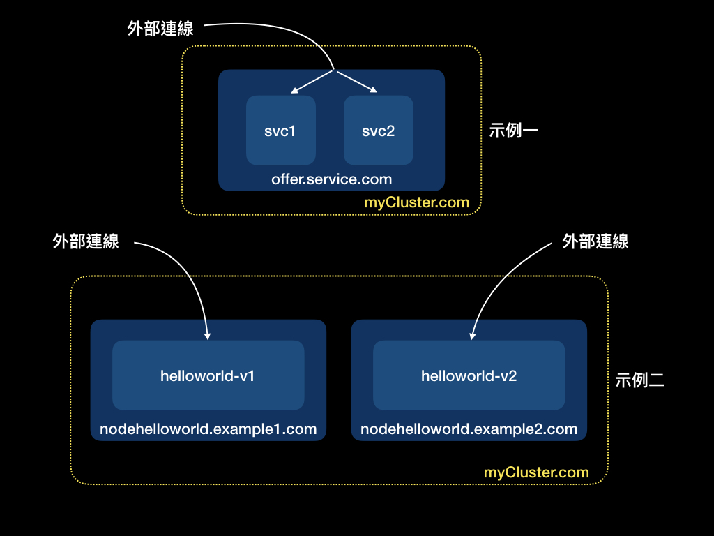

# 第十一天：k8s之四：進階篇之二，Ingress、Volume、PodPreset

Author: Nick Zhuang
Type: kubernetes

# 前言

今天是非常重要的一天，這個章節所介紹的內容，會與整個集群的規劃與建置息息相關，尤其是Volume，我們已經在前面幾個章節有用到它，另外，Ingress的部分是設計給外部連接群集服務用的，PodPreset是在Pod創建時，透過API的方式，動態增加它所能使用的資源，下面詳細介紹。

# Minikube的額外設置

在開始之前，我們要先修改minikube start的設置，不然有些功能會無法使用

    $minikube start --extra-config=apiserver.enable-admission-plugins=NamespaceLifecycle,LimitRanger,
    ServiceAccount,DefaultStorageClass,DefaultTolerationSeconds,NodeRestriction,MutatingAdmissionWebhook,
    ValidatingAdmissionWebhook,ResourceQuota,PodPreset \
    --extra-config=apiserver.runtime-config=settings.k8s.io/v1alpha1=true

# Ingress

要使用Ingress，就需要用到Ingress Controller，通過Ingress，我們可以輕鬆公開需要從外部訪問集群的服務。

這邊按照慣例給個例子，會比較好理解，我們先新建幾個檔案：

## 示例一：降低負載

    $vim ingress.yaml
    apiVersion: extensions/v1beta1
    kind: Ingress
    metadata:
      name: test
    spec:
      rules:
      - host: offer.service.com
        http:
          paths:
          - path: /svc1
            backend:
              serviceName: s1
              servicePort: 80
          - path: /svc2
            backend:
              serviceName: s2
              servicePort: 80

值得注意的是在minikube的環境，ingress的功能是預設關閉的，要先手動開啟

    $minikube addons enable ingress
    -   ingress was successfully enabled

接著開啟它

    $kubectl create -f ingress.yaml
    ingress.extensions/test created

我們來看看它的狀態

    $kubectl describe ing
    Name:             test
    Namespace:        default
    Address:
    Default backend:  default-http-backend:80 (<none>)
    Rules:
      Host           Path  Backends
      ----           ----  --------
      offer.service.com
                     /svc1   s1:80 (<none>)
                     /svc2   s2:80 (<none>)
    Annotations:
    Events:  <none>

檢查集群狀態，這裡用的NameSpace是kube-system，後面會介紹

    $kubectl get all -n kube-system
    NAME                                            READY   STATUS    RESTARTS   AGE
    pod/coredns-5644d7b6d9-8qlqv                    1/1     Running   1          9h
    pod/coredns-5644d7b6d9-fcplg                    1/1     Running   1          9h
    pod/etcd-minikube                               1/1     Running   1          9h
    pod/kube-addon-manager-minikube                 1/1     Running   1          9h
    pod/kube-apiserver-minikube                     1/1     Running   1          9h
    pod/kube-controller-manager-minikube            1/1     Running   1          9h
    pod/kube-proxy-zz7x6                            1/1     Running   1          9h
    pod/kube-scheduler-minikube                     1/1     Running   1          9h
    pod/nginx-ingress-controller-57bf9855c8-c46js   0/1     Running   0          10s
    pod/storage-provisioner                         1/1     Running   2          9h
    
    NAME               TYPE        CLUSTER-IP   EXTERNAL-IP   PORT(S)                  AGE
    service/kube-dns   ClusterIP   10.96.0.10   <none>        53/UDP,53/TCP,9153/TCP   9h
    
    NAME                        DESIRED   CURRENT   READY   UP-TO-DATE   AVAILABLE   NODE SELECTOR                 AGE
    daemonset.apps/kube-proxy   1         1         1       1            1           beta.kubernetes.io/os=linux   9h
    
    NAME                                       READY   UP-TO-DATE   AVAILABLE   AGE
    deployment.apps/coredns                    2/2     2            2           9h
    deployment.apps/nginx-ingress-controller   0/1     1            0           10s
    
    NAME                                                  DESIRED   CURRENT   READY   AGE
    replicaset.apps/coredns-5644d7b6d9                    2         2         2       9h
    replicaset.apps/nginx-ingress-controller-57bf9855c8   1         1         0       10s

可以看到nginx的controller開起來了

再來就是如果nginx controller運作正常，它就會把剛開起來的ingress配上ip

我們來看一下

    $kubectl get ing
    NAME   HOSTS               ADDRESS   PORTS   AGE
    test   offer.service.com             80      5s

過了一陣子就會配置ADDRESS

    $kubectl get ing
    NAME   HOSTS               ADDRESS     PORTS   AGE
    test   offer.service.com   10.0.2.15   80      17s

再詳細看一次狀態

    $kubectl describe ing
    Name:             test
    Namespace:        default
    Address:          10.0.2.15
    Default backend:  default-http-backend:80 (<none>)
    Rules:
      Host           Path  Backends
      ----           ----  --------
      offer.service.com
                     /svc1   s1:80 (<none>)
                     /svc2   s2:80 (<none>)
    Annotations:
    Events:
      Type    Reason  Age   From                      Message
      ----    ------  ----  ----                      -------
      Normal  CREATE  47m   nginx-ingress-controller  Ingress default/test
      Normal  UPDATE  46m   nginx-ingress-controller  Ingress default/test

OK，這是示例是要把近來的連線導到同一個host底下的不同的Service，如：svc1和svc2這兩個Service，這個設置可以用nodePort=LoadBalance取代，但在公有雲上，這樣的設置可以有效的減少loadBalance的使用

當這種轉發規則沒要用的時候，就可以：

    $kubectl delete ing test
    ingress.extensions "test" deleted

## 示例二：完美分流

這邊要示範如何使用ingress去access到不同的host中不同的Service

先設定新的ingress

### ingress-v2.yaml

    $vim ingress-v2.yaml
    apiVersion: extensions/v1beta1
    kind: Ingress
    metadata:
      name: test
    spec:
      rules:
      - host: nodehelloworld.example1.com
        http:
          paths:
          - backend:
              serviceName: helloworld-v1
              servicePort: 80
      - host: nodehelloworld.example2.com
        http:
          paths:
          - backend:
              serviceName: helloworld-v2
              servicePort: 80

看一下詳細狀態

    $kubectl describe ing
    Name:             test
    Namespace:        default
    Address:          10.0.2.15
    Default backend:  default-http-backend:80 (<none>)
    Rules:
      Host                         Path  Backends
      ----                         ----  --------
      nodehelloworld.example1.com
                                      helloworld-v1:80 (<none>)
      nodehelloworld.example2.com
                                      helloworld-v2:80 (<none>)
    Annotations:
    Events:
      Type    Reason  Age    From                      Message
      ----    ------  ----   ----                      -------
      Normal  CREATE  2m31s  nginx-ingress-controller  Ingress default/test
      Normal  UPDATE  2m17s  nginx-ingress-controller  Ingress default/test

檢查集群狀態

    $kubectl get ing
    NAME   HOSTS                                                     ADDRESS     PORTS   AGE
    test   nodehelloworld.example1.com,nodehelloworld.example2.com   10.0.2.15   80      2m2s

接著我們定義兩個Pod+Service的YAML

### helloworld-v1.yaml

    $vim helloworld-v1.yaml
    apiVersion: v1
    kind: Pod
    metadata:
      name: nodehelloworld.example1.com
      labels:
        app: helloworld-v1
    spec:
      containers:
      - name: k8s-demo
        image: 105552010/k8s-demo:v1
        ports:
        - name: nodejs-port
          containerPort: 3000
    ---
    apiVersion: v1
    kind: Service
    metadata:
      name: helloworld-v1
    spec:
      type: NodePort
      ports:
      - port: 80
        nodePort: 30303
        targetPort: 3000
        protocol: TCP
        name: http
      selector:
        app: helloworld-v1

### helloworld-v2.yaml

    $vim helloworld-v2.yaml
    apiVersion: v1
    kind: Pod
    metadata:
      name: nodehelloworld.example2.com
      labels:
        app: helloworld-v2
    spec:
      containers:
      - name: k8s-demo
        image: 105552010/k8s-demo:v2
        ports:
        - name: nodejs-port
          containerPort: 3000
    ---
    apiVersion: v1
    kind: Service
    metadata:
      name: helloworld-v2
    spec:
      type: NodePort
      ports:
      - port: 80
        nodePort: 30304
        targetPort: 3000
        protocol: TCP
        name: http
      selector:
          app: helloworld-v2

再來開啟這兩個Pod+Service

    $kubectl create -f helloworld-v1.yaml
    pod/nodehelloworld.example1.com created
    service/helloworld-v1 created
    $kubectl create -f helloworld-v2.yaml
    pod/nodehelloworld.example2.com created
    service/helloworld-v2 created

注意到這裡的Service與[之前](https://github.com/x1y2z3456/ironman/blob/master/day9/README.md)用命令列設置的方式不同，是用YAML去設置的（標準做法）

ingress+pod*2+service*2都開好後，我們來做個小測試！

我們來檢查下集群的IP

    $minikube ip
    192.168.99.100

改下minikube集群的DNS設定

    sudo echo "myCluster.com    192.168.99.100" >> /etc/hosts

接著我們從集群外部去access在Ingress上設置好的host名稱

連線nodehelloworld.example1.com

    $curl myCluster.com -H 'Host: nodehelloworld.example1.com'
    Hello World!

連線nodehelloworld.example2.com

    $curl myCluster.com -H 'Host: nodehelloworld.example2.com'
    Hello World v2!

可以注意到Ingress發揮它的效用，依照給定的host名稱，分別去access不同的Service！

### 比較示例一和示例二：

第一個例子是把一個連線，按照他所需要的集群內去選擇要使用哪一個Service。

第二個例子是可以設定不同的Service去access，並透過Ingress去做完整服務切割的目的，它會依照我們給定的host名稱去使用對應的Service，達到完全分流的效果。

這邊是用到minikube預設的nginx ingress controller，也有其他的controller可以用，如：[traefik](https://github.com/dfang/traefik-on-minikube-demo)

# Volume

這個元件是用來儲存永久資料的，之前在學習Pod的時候，我們已經知道它是一個stateless的物件，也就是說在Pod上面的資料無法保存，當Pod終止後，在它裡面的資料會消失，所以必須要透過Volume來達成儲存資料的需求，Volume必須是要掛載的，它也能夠利用這個特性去達成轉移資料的目的，當我有另外一個Pod需要用到同筆資料，那麼我把之前設定的Volume掛載到新的Pod上就可以，我們在前面，介紹ConfigMap、Secret的時候有看到過，這邊給個簡單的例子幫助理解：

volume有很多掛載模式，包括公有雲的，如：AWS，或是私有雲的，如：local、NFS，這邊僅示範local的，其他的概念類似，只是要改一些設定，像是掛載模式等等，在後續的雲端操作上會增加AWS上的操作。

除了Volume之外，有另外一種元件叫PersistentVolume，簡稱PV，管理篇會介紹

新增一個Pod和Volume，Volume的掛載路徑是/tmp/volume

    $vim pod-v.yaml
    kind: Pod
    apiVersion: v1
    metadata:
      name: v-pod
      labels:
        name: Volume
    spec:
      volumes:
      - name: example-volume
        emptyDir: {}
      containers:
      - name: volume-container
        image: 105552010/k8s-demo
        command: ["/bin/sh", "-c", "sleep infinity"]
        volumeMounts:
        - name: example-volume
          mountPath: /tmp/volume

檢查這個Pod的狀態

    $kubectl get po v-pod
    NAME    READY   STATUS    RESTARTS   AGE
    v-pod   1/1     Running   0          11s

接著我們到Pod裡面操作

    $kubectl exec -it v-pod bash
    root@v-pod:/app# cd /tmp/volume
    root@v-pod:/tmp/volume# echo hello >> test.txt
    root@v-pod:/tmp/volume# cat test
    hello

再來我們把Pod中的Container重啟

    root@v-pod:/app# apt update
    root@v-pod:/app# apt install procps
    root@v-pod:/app# ps aux
    USER       PID %CPU %MEM    VSZ   RSS TTY      STAT START   TIME COMMAND
    root         1  0.0  0.0   4336   788 ?        Ss   16:08   0:00 /bin/sh -c sleep infinity
    root         7  0.0  0.0   4236   672 ?        S    16:08   0:00 sleep infinity
    root         8  0.0  0.1  20256  3252 pts/0    Ss   16:08   0:00 bash
    root        18  0.0  0.1  17500  2072 pts/0    R+   16:09   0:00 ps aux
    root@v-pod:/app# kill -9 7
    root@v-pod:/app# command terminated with exit code 137

會有短暫的時間不能用Container，因為還在重啟

    $kubectl exec -it v-pod bash
    error: unable to upgrade connection: container not found ("volume-container")

檢查Pod的狀態（應顯示Container重啟到運行中的狀態

    $kubectl get po v-pod
    NAME                          READY   STATUS    RESTARTS   AGE
    v-pod                         0/1     Error     0          12m
    $kubectl get po v-pod
    NAME                          READY   STATUS             RESTARTS   AGE
    v-pod                         0/1     CrashLoopBackOff   0          12m
    $kubectl get po v-pod
    NAME                          READY   STATUS             RESTARTS   AGE
    v-pod                         0/1     ContainerCreating  0          12m
    $kubectl get po v-pod
    NAME                          READY   STATUS             RESTARTS   AGE
    v-pod                         0/1     Running            1          12m

這時候我們再進到Container裡面，可以發現Pod進程的狀態改變了！

    $kubectl exec -it v-pod bash
    root@v-pod:/app# ls
    Dockerfile  docker-compose.yml  index-db.js  index.js  misc  node_modules  package.json
    root@v-pod:/app# ps aux
    USER       PID %CPU %MEM    VSZ   RSS TTY      STAT START   TIME COMMAND
    root         1  0.0  0.0   4336   804 ?        Ss   16:09   0:00 /bin/sh -c sleep infinit
    root         6  0.0  0.0   4236   716 ?        S    16:09   0:00 sleep infinity
    root         7  0.0  0.1  20256  3220 pts/0    Ss   16:09   0:00 bash
    root        13  0.0  0.1  17500  2180 pts/0    R+   16:09   0:00 ps aux

切換到剛剛建立test.txt的目錄，看看資料還在不在

    root@v-pod:/app# cd /tmp
    root@v-pod:/tmp# ls
    npm-6-aab8afe6  volume
    root@v-pod:/tmp# cd volume/
    root@v-pod:/tmp/volume# ls
    test.txt
    root@v-pod:/tmp/volume# cat test.txt
    hello
    root@v-pod:/tmp/volume# exit

檔案完好如初，沒有消失，且內容不變，代表Volume的設置是有效的。

# PodPreset

這個元件是關於在Pod設置的時候，可以動態的去修改既有設定，有幾種面向可以修改，像是：Secret、Volume、Volume mount、環境變數等等。

另外值得一提的是：

- 如果有Pod不要受到PodPreset的限制，那就在Pod裡面的spec區定義：podpreset.admission.kubernetes.io/exclude："true"
- 如果PodPreset的設定與原來的Pod有衝突，將會忽略設置

這裡給個例子：

設定一個helloworld的Pod

    $vim helloworld.yaml
    apiVersion: v1
    kind: Pod
    metadata:
      name: nodehelloworld.example.com
      labels:
        app: helloworld
        role: backend
    spec:
      containers:
      - name: k8s-demo
        image: 105552010/k8s-demo
        ports:
        - name: nodejs-port
          containerPort: 3000

設定第一個PodPreset

    $vim podPreset-1.yaml
    apiVersion: settings.k8s.io/v1alpha1
    kind: PodPreset
    metadata:
      name: allow-database
      namespace: default
    spec:
      selector:
        matchLabels:
          role: backend
      env:
        - name: DB_PORT
          value: "3307"
      volumeMounts:
        - mountPath: /cache
          name: cache-volume
      volumes:
        - name: cache-volume
          emptyDir: {}

設定第二個PodPreset

    $vim podPreset-2.yaml
    apiVersion: settings.k8s.io/v1alpha1
    kind: PodPreset
    metadata:
      name: proxy
      namespace: default
    spec:
      selector:
        matchLabels:
          role: backend
      volumeMounts:
        - mountPath: /etc/proxy/configs
          name: proxy-volume
      volumes:
        - name: proxy-volume
          emptyDir: {}

接著依序啟動

    $kubectl create -f podPreset-1.yaml
    podpreset.settings.k8s.io/allow-database created
    $kubectl create -f podPreset-2.yaml
    podpreset.settings.k8s.io/proxy created
    $kubectl create -f helloworld-podPreset.yaml
    pod/nodehelloworld.example.com created

再來檢視Pod的狀態

    $kubectl describe po nodehelloworld.example.com
    Name:               nodehelloworld.example.com
    Namespace:          default
    Priority:           0
    PriorityClassName:  <none>
    Node:               minikube/10.0.2.15
    Start Time:         Wed, 25 Sep 2019 09:18:44 +0800
    Labels:             app=helloworld
                        role=backend
    Annotations:        podpreset.admission.kubernetes.io/podpreset-allow-database: 919
                        podpreset.admission.kubernetes.io/podpreset-proxy: 1589
    Status:             Pending
    IP:
    Containers:
      k8s-demo:
        Container ID:
        Image:          105552010/k8s-demo
        Image ID:
        Port:           3000/TCP
        Host Port:      0/TCP
        State:          Waiting
          Reason:       ContainerCreating
        Ready:          False
        Restart Count:  0
        Environment:
          DB_PORT:  6379
        Mounts:
          /cache from cache-volume (rw)
          /etc/proxy/configs from proxy-volume (rw)
          /var/run/secrets/kubernetes.io/serviceaccount from default-token-rjf6n (ro)
    Conditions:
      Type              Status
      Initialized       True
      Ready             False
      ContainersReady   False
      PodScheduled      True
    Volumes:
      cache-volume:
        Type:       EmptyDir (a temporary directory that shares a pod's lifetime)
        Medium:
        SizeLimit:  <unset>
      proxy-volume:
        Type:       EmptyDir (a temporary directory that shares a pod's lifetime)
        Medium:
        SizeLimit:  <unset>
      default-token-rjf6n:
        Type:        Secret (a volume populated by a Secret)
        SecretName:  default-token-rjf6n
        Optional:    false
    QoS Class:       BestEffort
    Node-Selectors:  <none>
    Tolerations:     node.kubernetes.io/not-ready:NoExecute for 300s
                     node.kubernetes.io/unreachable:NoExecute for 300s
    Events:
      Type    Reason     Age        From               Message
      ----    ------     ----       ----               -------
      Normal  Scheduled  <unknown>  default-scheduler  Successfully assigned default/nodehelloworld.example.com to minikube
      Normal  Pulling    27s        kubelet, minikube  Pulling image "105552010/k8s-demo"

可以看到PodPreset的設定有放到Pod裡面，測試成功！

# 小結

今天我們先看到了Ingress，透過設置它我們可以降低系統的loading，或是達到完全分流的目的。接著我們介紹了Volume，這是一個很常用的元件，它可以保證在Pod裡面的資料不會丟失，類似暫存區的效果，我們也提到了PersistentVolume，管理篇會詳細介紹，最後我們看到了PodPreset，它可以在執行階段的時候動態增加Pod的設置，像是ConfigMap或是ReplicaSet都可以，明天將接續進階篇的介紹，敬請期待！明天見囉！

# 參考資料：

- [Ingress簡介](https://kubernetes.io/docs/concepts/services-networking/ingress/)
- [Volume簡介](https://kubernetes.io/docs/concepts/storage/volumes/#hostpath)
- [Pod與Volume](https://kubernetes.io/docs/tasks/configure-pod-container/configure-volume-storage/)
- [PersistentVolume](https://kubernetes.io/docs/concepts/storage/persistent-volumes/)
- [PodPreset簡介](https://kubernetes.io/docs/concepts/workloads/pods/podpreset/)
- [PodPreset操作示例](https://kubernetes.io/zh/docs/tasks/inject-data-application/podpreset/)
