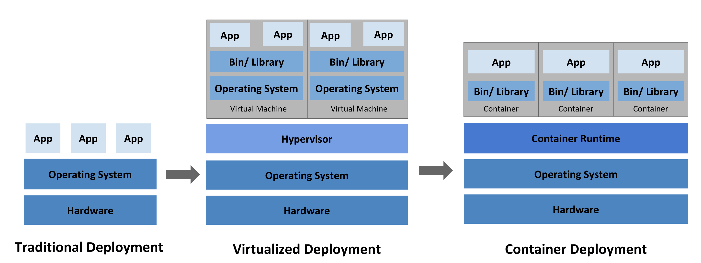
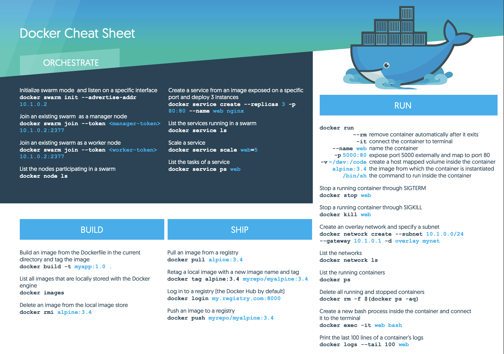

# 第二天：一日碼頭工：快速Docker複習

Author: Nick Zhuang
Type: docker

# 前言

為了幫助大家了解k8s的究竟好用在哪邊，我想我們今天就來稍微複習一下Docker的功能

先讓大家對Docker有個基礎了解，再從這個施力點去理解k8s我想會比較簡單，畢竟兩者在部分觀念上有些重疊，那個我們就開始吧！

# 那些年，單機是唯一真愛

很久很久以前，那是一個，單機系統當道的年代...

那個時候還沒有虛擬化，容器就更不用說了

當初的虛擬化技術（像是Virtual Box），是為了解決單機系統本身的限制而出現的

這個技術解決了單機多系統的問題，也就是可以在同一台電腦上，同時跑兩個以上作業系統

但隨著時間推衍，後來人們發現了虛擬化的問題，像是：

- 每次開好幾個系統都要等一下子，能否將時間縮更短？
- 開發用的電腦，新進人員來了，環境設置整個重新來過，我的天，可不可以不要這麼累？
- 我的電腦，現在同時開了好幾個虛擬機，好像有點卡頓，怎麼辦？

為了避免上述問題，於是容器化技術就誕生了，輕量化、快速啟動、易移植等特性，用了容器後：

- 太好了，開機變快了
- 不用擔心要重灌，直接請他裝Docker，我再把鏡像移植給他就好
- 使用容器跑，容器並不會虛擬化硬體堆疊，而是會在作業系統層級虛擬化，進而讓多個容器直接在 OS 核心之上執行，就不會卡頓了

現在我們理解為何要用容器了，接下來都以Docker為例子，因為我們是要介紹k8s。

# 快速複習Docker

我們來看張Cheet Sheet吧！

### 以下列出幾個常用的重點：

基本觀念：由鏡像啟動容器，從容器啟動程序

### 建置類：

    #建立新的鏡像，那個點是指當前目錄的Dockerfile
    docker build -t myapp:1.0 .
    #列出所有的鏡像
    docker images
    #刪除鏡像
    docker rmi alpine:3.4

### 傳輸類：

    #下載鏡像
    docker pull alpine:3.4
    #改鏡像名稱
    docker tag alpine:3.4 myrepo/myalpine:3.4
    #登入，可以是Docker hub或是private registry
    docker login my.registry.com:8000
    #上傳鏡像
    docker push myrepo/myalpine:3.4

### 執行類：

    #啟動容器
    docker run -it --name web alpine:3.4 bash
    #關閉容器
    docker stop web
    #列出執行的容器
    docker ps
    #刪除所有容器
    docker rm -f $(docker ps -aq)
    #執行一個已經存在的容器
    docker exec -it web bash

# 小結

從上述我們可以看到Docker是怎麼來的，以及為什麼會需要它

鑑往知來，也因此我們也能夠理解為何會需要用到k8s

明天會介紹架設小型群集的方式，並在後天整合Docker指令到k8s中

第二天就到這邊囉！謝謝收看～明天見啦！

# 參考資料

- [Docker中文版文檔](https://philipzheng.gitbooks.io/docker_practice/content/introduction/what.html)
- [Docker官方文件](https://docs.docker.com/get-started/)
- [Docker安裝](https://docs.docker.com/install/)
- [Docker的Cheat Sheet](https://www.docker.com/sites/default/files/Docker_CheatSheet_08.09.2016_0.pdf)
- [什麼是k8s](https://kubernetes.io/docs/concepts/overview/what-is-kubernetes/)

本文同步刊載於[https://github.com/x1y2z3456/ironman](https://github.com/x1y2z3456/ironman)

感謝您撥冗閱讀此文章，不喜勿噴，有任何問題建議歡迎下方留言：）

說個笑話，希望我能寫滿30天啊（笑