# [Day20] k8s實務篇（一）：EKS架設k8s（上）

Author: Nick Zhuang
Type: kubernetes

# 前言

昨天我們稍微說明了雲端上k8s運作的基本邏輯，也介紹了一些會用到的AWS元件並做了些前置準備，今天我們從頭開始，一步步把k8s在AWS上的群集建立起來。內容會稍微複雜，所以分成上下兩篇。

上篇的部分：AWS的基礎設置、創建k8s的控制介面（Today）

下篇的部分：kubectl的安裝與設置、登入EC2的工作節點（Tomorrow）

@重要提醒：使用EKS不是免費的，除非你有綁定信用卡的額外預算，不然最好是速速部署測試，一小時約6塊TWD，沒用的時候記得關掉！~~不然就準備噴錢囉~~

# AWS的基礎設置

我們先回到Management Service的介面，尋找cloudformation這個服務

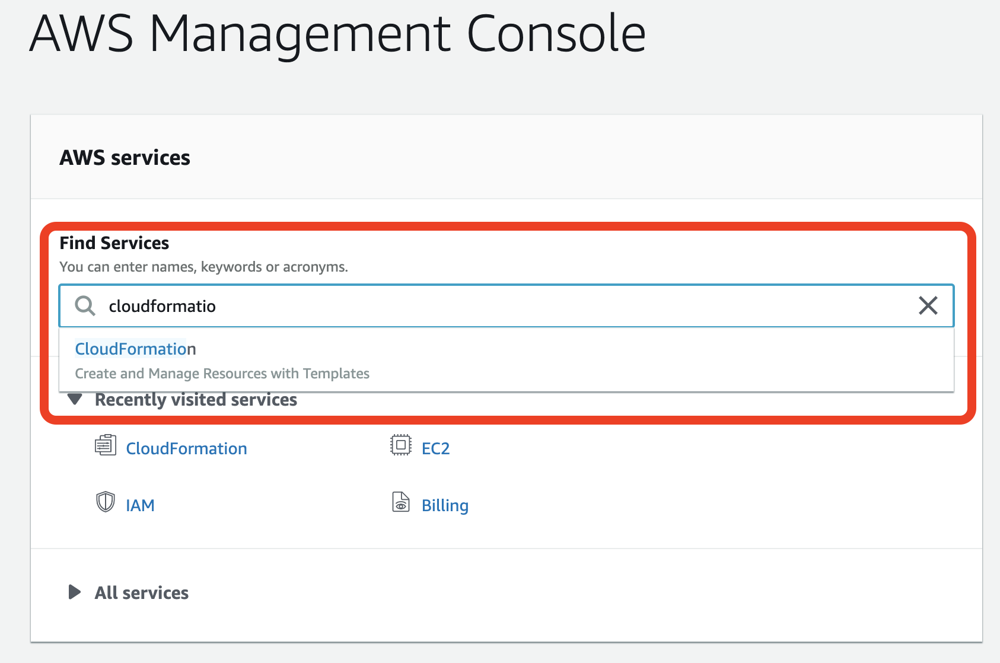

接著Create Stack

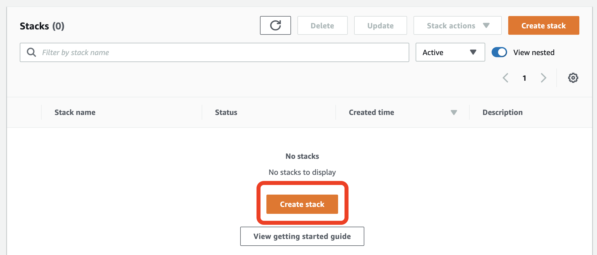

接著我們導入一個VPC的template，詳細可參考[文檔](https://docs.aws.amazon.com/en_us/codebuild/latest/userguide/cloudformation-vpc-template.html)

    ---
    AWSTemplateFormatVersion: '2010-09-09'
    Description: 'AWS EKS'
    
    Parameters:
    
      VpcBlock:
        Type: String
        Default: 192.168.0.0/16
        Description: CIDR range for VPC
    
      Subnet01Block:
        Type: String
        Default: 192.168.64.0/18
        Description: CIDR for first subnet within VPC
    
      Subnet02Block:
        Type: String
        Default: 192.168.128.0/18
        Description: CIDR for second subnet within VPC
    
      Subnet03Block:
        Type: String
        Default: 192.168.192.0/18
        Description: CIDR for third subnet within VPC
    
    Resources:
      VPC:
        Type: AWS::EC2::VPC
        Properties:
          CidrBlock:  !Ref VpcBlock
          EnableDnsSupport: true
          EnableDnsHostnames: true
          Tags:
          - Key: Name
            Value: !Sub '${AWS::StackName}-VPC'
    
      InternetGateway:
        Type: "AWS::EC2::InternetGateway"
    
      VPCGatewayAttachment:
        Type: "AWS::EC2::VPCGatewayAttachment"
        Properties:
          InternetGatewayId: !Ref InternetGateway
          VpcId: !Ref VPC
    
      RouteTable:
        Type: AWS::EC2::RouteTable
        Properties:
          VpcId: !Ref VPC
          Tags:
          - Key: Name
            Value: Public Subnets
          - Key: Network
            Value: Public
    
      Route:
        DependsOn: VPCGatewayAttachment
        Type: AWS::EC2::Route
        Properties:
          RouteTableId: !Ref RouteTable
          DestinationCidrBlock: 0.0.0.0/0
          GatewayId: !Ref InternetGateway
    
      Subnet01:
        Type: AWS::EC2::Subnet
        Properties:
          AvailabilityZone:
            Fn::Select:
            - '0'
            - Fn::GetAZs:
                Ref: AWS::Region
          CidrBlock:
            Ref: Subnet01Block
          VpcId:
            Ref: VPC
          Tags:
          - Key: Name
            Value: !Sub "${AWS::StackName}-Subnet1"
    
      Subnet02:
        Type: AWS::EC2::Subnet
        Properties:
          AvailabilityZone:
            Fn::Select:
            - '1'
            - Fn::GetAZs:
                Ref: AWS::Region
          CidrBlock:
            Ref: Subnet02Block
          VpcId:
            Ref: VPC
          Tags:
          - Key: Name
            Value: !Sub "${AWS::StackName}-Subnet2"
    
      Subnet03:
        Type: AWS::EC2::Subnet
    
        Properties:
          AvailabilityZone:
            Fn::Select:
            - '2'
            - Fn::GetAZs:
                Ref: AWS::Region
          CidrBlock:
            Ref: Subnet03Block
          VpcId:
            Ref: VPC
          Tags:
          - Key: Name
            Value: !Sub "${AWS::StackName}-Subnet3"
    
      Subnet01RouteTableAssociation:
        Type: AWS::EC2::SubnetRouteTableAssociation
        Properties:
          SubnetId: !Ref Subnet01
          RouteTableId: !Ref RouteTable
    
      Subnet02RouteTableAssociation:
        Type: AWS::EC2::SubnetRouteTableAssociation
        Properties:
          SubnetId: !Ref Subnet02
          RouteTableId: !Ref RouteTable
    
      Subnet03RouteTableAssociation:
        Type: AWS::EC2::SubnetRouteTableAssociation
        Properties:
          SubnetId: !Ref Subnet03
          RouteTableId: !Ref RouteTable
    
      ControlPlaneSecurityGroup:
        Type: AWS::EC2::SecurityGroup
        Properties:
          GroupDescription: Cluster communication with worker nodes
          VpcId: !Ref VPC
    
    Outputs:
    
      SubnetIds:
        Description: your subnets
        Value: !Join [ ",", [ !Ref Subnet01, !Ref Subnet02, !Ref Subnet03 ] ]
    
      SecurityGroups:
        Description: SecGroup for communication betw controlplane and workernodes
        Value: !Join [ ",", [ !Ref ControlPlaneSecurityGroup ] ]
    
      VpcId:
        Description: The VPC Id
        Value: !Ref VPC

接著應顯示如下，可以檢視Design去看它的設計拓墣架構，這裡筆者直接下一步

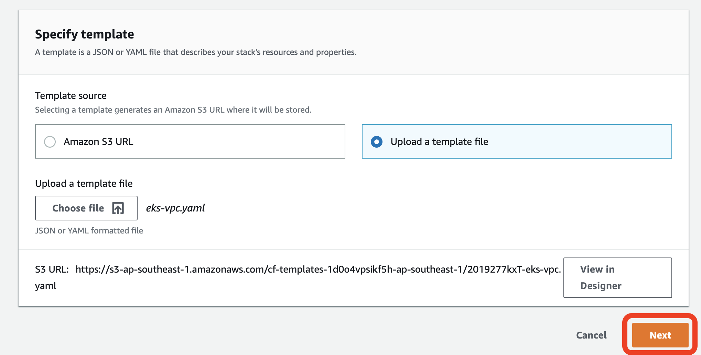

設定名稱EKS-stack，好了下一步

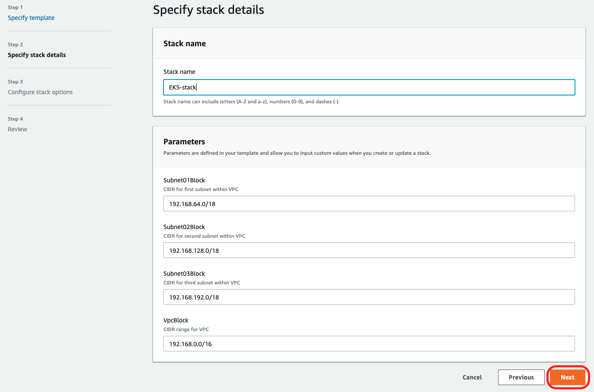

後面都不用改什麼設定，直接下一步到Create Stack就行

再來就是檢視完成介面

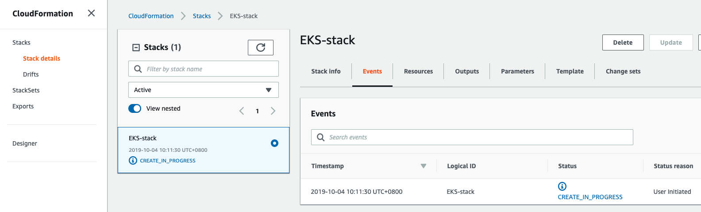

會稍微花一點時間，要等它一下，喝口茶，休息一下。~~（睡個覺再來~~

好了應該要有類似訊息

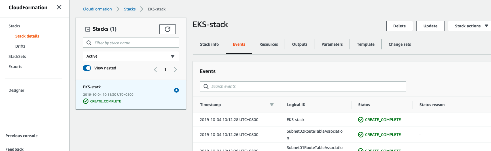

檢查Output

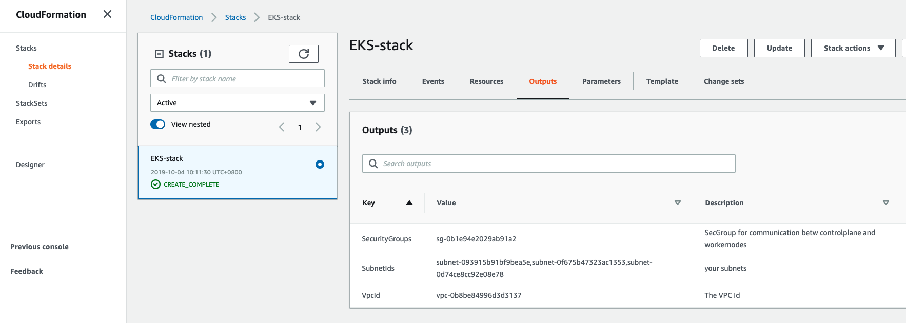

OK，看起來沒啥問題，我們接續下個部分

# 創建k8s的控制介面

這個部分我們延續前面繼續操作，直接設置

我們先回到Management Service的介面，尋找EKS這個服務，然後到那個頁面後，選擇Clusters

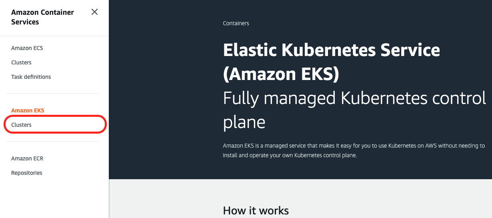

這邊是要我們建立一個新的Cluster，我們先做些設定

主要是把一些我們前面設置過的設定套用，像是EKS開頭的那些東西

設定cluster name、k8s version、role name，目前EKS只支援到1.14，現在最新是1.16，也就是我們之前minikube用的k8s版本

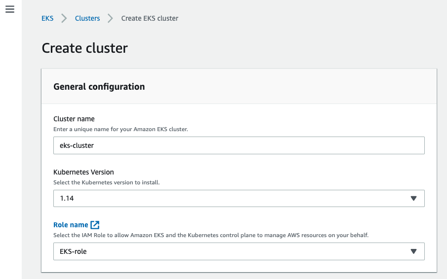

設置VPC及對應的子網域（這個在選定VPC後應會自動套入），它原本就有個預設的VPC，不要選錯了！

設定Security groups，也是找EKS相關的

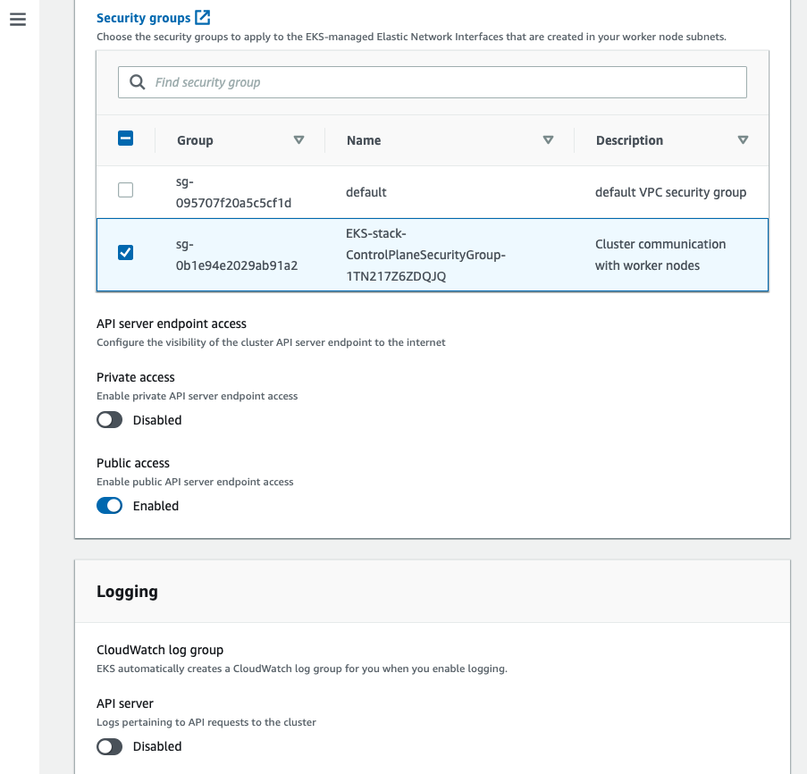

Security group下面的可以用預設值不調，看個人喜好（筆者沒調，好了按Create

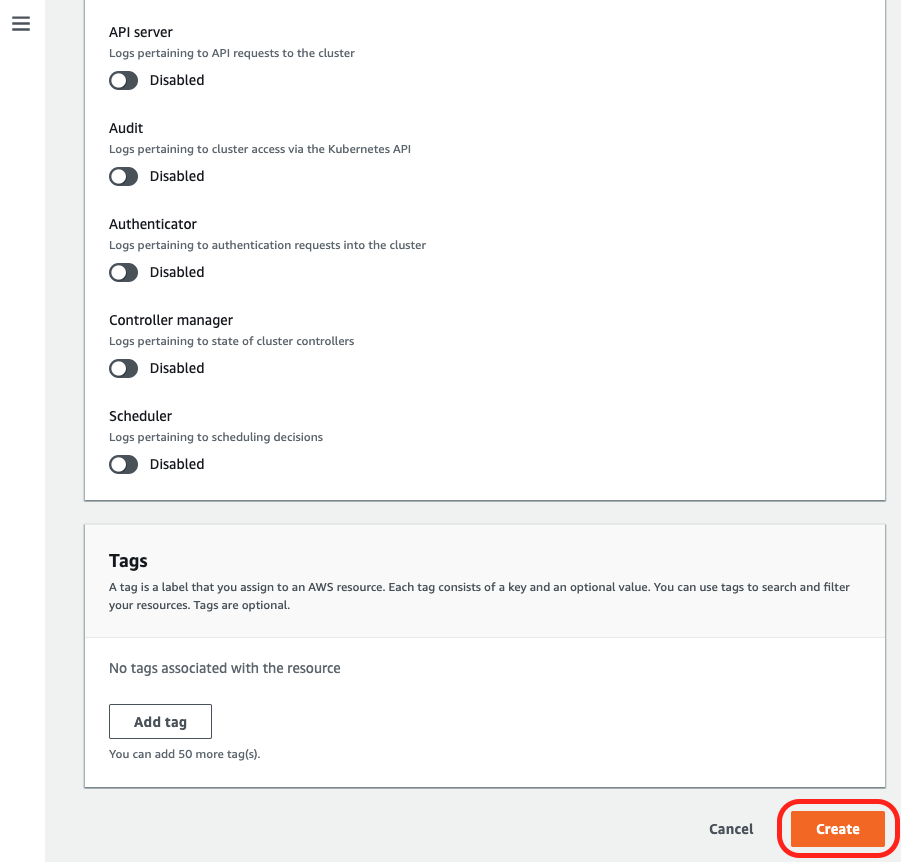

接著AWS就會幫我們建立EKS的cluster了，要等一段時間（這個蠻久的，可以小睡一下

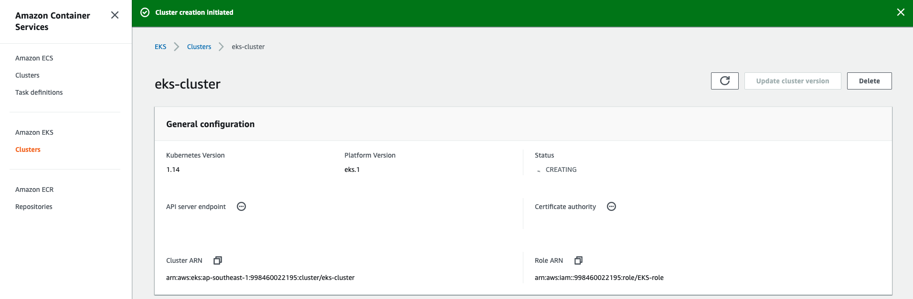

好了會長這樣，筆者大概等了10分左右

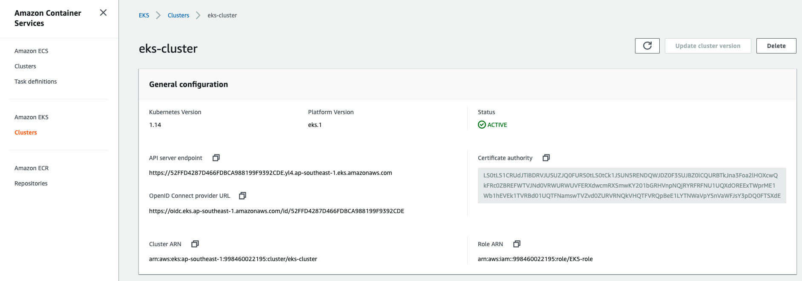

OK，到這邊關於創建k8s的控制介面的部分就結束囉！

# 小結

今天我們已經將k8s架設在AWS實務篇之上卷走過啦！就是AWS的基礎設置、創建k8s的控制介面的內容。到這邊關於EKS的設置已經過了一半了，在下卷的內容，我們會提到關於kubectl的安裝與設置、登入EC2的工作節點等等的內容，AWS雖然一開始用起來眼花撩亂，但久了還是可以習慣（咦，有押韻，走到這邊，筆者會建議先將前面基礎篇、進階篇、管理篇等內容複習一次，因為我們到時候上雲後，會在驗證一部份的前面內容，因為在日常的維運當中，很多時候其實你是在雲端的環境下指令的，本地端的minikube只是給你測試用而已，加油！我們明天見～

# 參考資料

- [AWS EKS Cluster](https://docs.aws.amazon.com/en_us/eks/latest/userguide/clusters.html)
- [AWS VPC](https://aws.amazon.com/tw/vpc/faqs/)
- [AWS Cloud Formation](https://docs.aws.amazon.com/en_us/AWSCloudFormation/latest/UserGuide/using-cfn-updating-stacks-direct.html)

