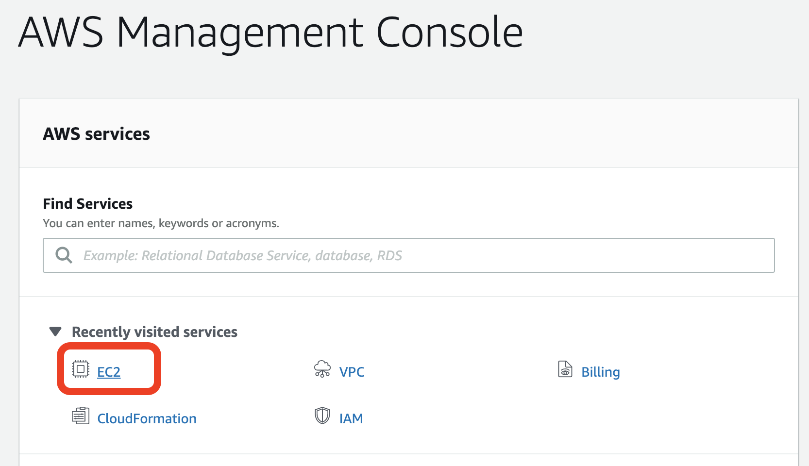
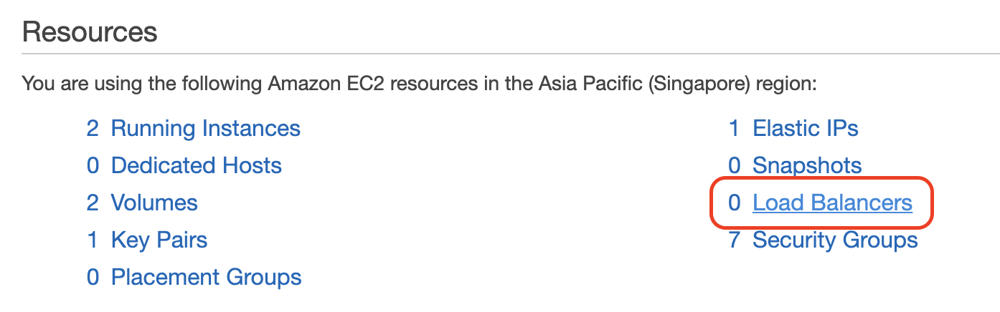
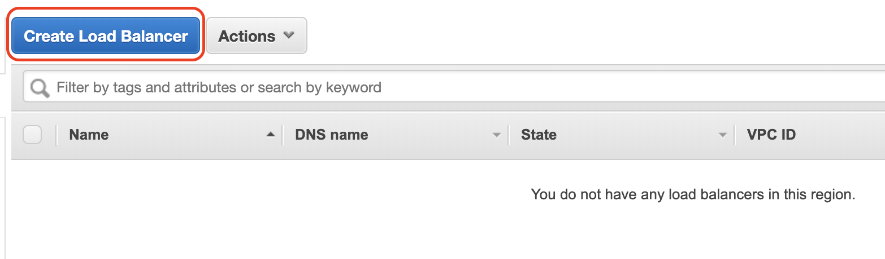
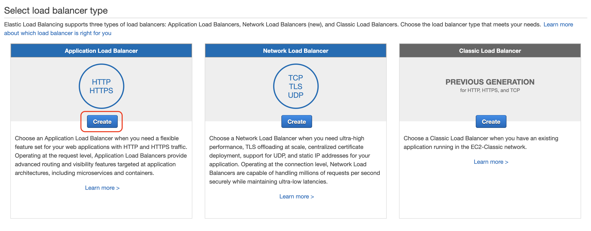
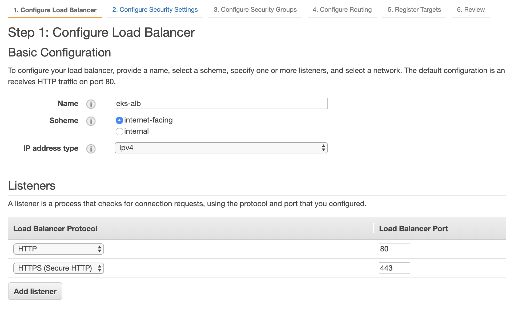
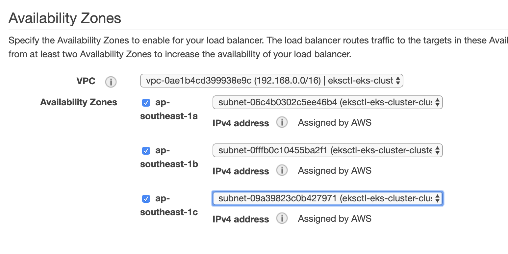
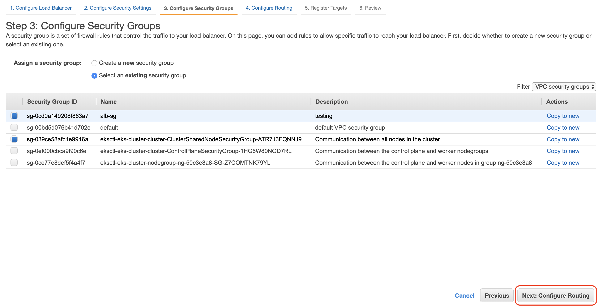
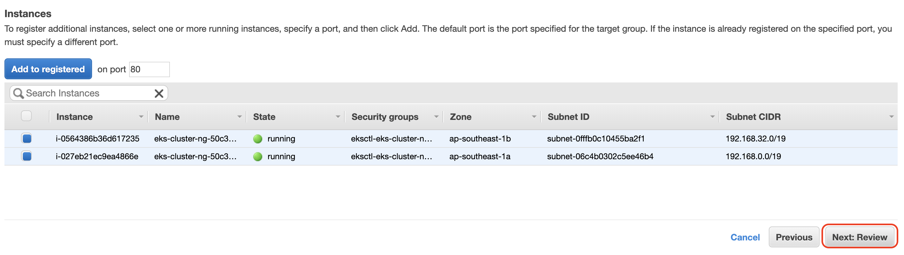
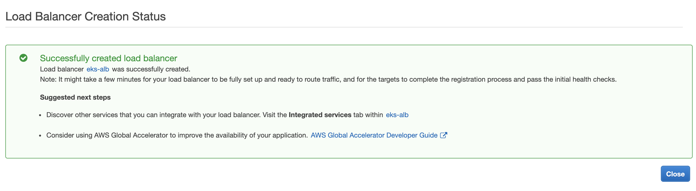
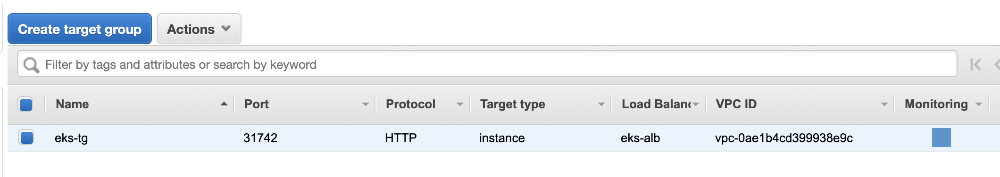

# [Day23] k8s進階篇延伸與EKS（一）：Ingress、ELB、Service

Author: Nick Zhuang
Type: kubernetes

# 前言

昨天我們看完了基礎篇的內容，今天開始我們要來瀏覽在進階篇的範疇內，minikube與EKS不同的地方，關於進階篇的內容分為兩篇，第一篇主要著重於Ingress及Service的部分，我們將著重於在AWS上實做一個traefik的Ingress，之前在minikube上實做的是nginx的Ingress，可以比較一下差異。第二篇是講述Affinity and Anti-Affinity、Taints and Tolerations、Cordon and Uncordon and Drain結合應用的內容。我們不會再檢視StatefulSet和DaemonSet的內容，因為他們的操作方法與Deployment類似，回顧可以參考[這裡](https://github.com/x1y2z3456/ironman/tree/master/day11)。

# 進階篇

## Ingress

接著我們在既有的AWS群集上，實作一個traefik Ingress，這個操作同時也會與Service有關，我們的目標是透過這個Ingress達到ALB（Application Load Balancer）的目的。

    $mkdir traefik
    $cd treafik

### 創建YAML並APPLY

我們先新增幾個檔案，將他們置於traefik的目錄底下

新增app.yaml

    $vim app.yaml
    apiVersion: v1
    kind: Service
    metadata: 
      name: greeting-service
    spec: 
      selector: 
        app: greeting-pod
      ports:
        - name: web
          port: 80
          targetPort: 8080
      #type: NodePort
    ---
    apiVersion: extensions/v1beta1
    kind: Deployment
    metadata:
      name: greeting
    spec:
      replicas: 2
      template:
        metadata:
          labels:
            app: greeting-pod
        spec:
          tolerations:
          - key: "spotInstance"
            # operator: "Exists"
            value: "true"
            effect: "PreferNoSchedule"   
          containers:
          - name: greeting-pod
            image: pahud/greeting:latest
            env:
            - name: MY_TYPE
              value: greeting
            ports:
            - containerPort: 8080
    ---
    apiVersion: v1
    kind: Service
    metadata: 
      name: caddy-service
    spec: 
      selector: 
        app: caddy-pod
      ports:
        - name: web
          port: 80
          targetPort: 2015
      #type: NodePort
    ---
    apiVersion: extensions/v1beta1
    kind: Deployment
    metadata:
      name: caddy
    spec:
      replicas: 2
      template:
        metadata:
          labels:
            app: caddy-pod
        spec:
          containers:
          - name: caddy-pod
            image: abiosoft/caddy:php
            #image: abiosoft/caddy
            env:
            - name: MY_TYPE
              value: caddy
            ports:
            - containerPort: 2015
    ---
    apiVersion: v1
    kind: Service
    metadata: 
      name: nginx-service
    spec: 
      selector: 
        app: nginx-pod
      ports:
        - name: web
          port: 80
          targetPort: 80
      #type: NodePort
    ---
    apiVersion: extensions/v1beta1
    kind: Deployment
    metadata:
      name: nginx
    spec:
      replicas: 2
      template:
        metadata:
          labels:
            app: nginx-pod
        spec:
          containers:
          - name: nginx-pod
            image: nginx
            env:
            - name: MY_TYPE
              value: nginx
            ports:
            - containerPort: 80

新增caddy.yaml

    $vim caddy.yaml
    ---
    apiVersion: v1
    kind: Service
    metadata: 
      name: caddy-service
    spec: 
      selector: 
        app: caddy-pod
      ports:
        - name: web
          port: 80
          targetPort: 2015
      #type: NodePort
    ---
    apiVersion: extensions/v1beta1
    kind: Deployment
    metadata:
      name: caddy
    spec:
      replicas: 2
      template:
        metadata:
          labels:
            app: caddy-pod
        spec:
          containers:
          - name: caddy-pod
            image: abiosoft/caddy:php
            #image: abiosoft/caddy
            env:
            - name: MY_TYPE
              value: caddy
            ports:
            - containerPort: 2015

新增ingress-rbac.yaml

    $vim ingress-rbac.yaml
    apiVersion: v1
    kind: ServiceAccount
    metadata:
      name: ingress
      namespace: kube-system
    ---
    kind: ClusterRoleBinding
    apiVersion: rbac.authorization.k8s.io/v1beta1
    metadata:
      name: ingress
    subjects:
      - kind: ServiceAccount
        name: ingress
        namespace: kube-system
    roleRef:
      kind: ClusterRole
      name: cluster-admin
      apiGroup: rbac.authorization.k8s.io

這個部分我們之前有提過，rbac是基於角色的權限控制

新增ingress.yaml

    $vim ingress.yaml
    apiVersion: extensions/v1beta1
    kind: Ingress
    metadata:
      name: traefik-ingress
      namespace: default
      annotations:
        kubernetes.io/ingress.class: traefik
        traefik.frontend.rule.type: PathPrefixStrip
    spec:
      rules:
      - 
        #host: greeting.xxx.io
        http:
          paths:
          - path: /
            backend:
              serviceName: greeting-service
              servicePort: 80
      - 
        #host: caddy.xxx.io
        http:
          paths:
          - path: /caddy
            backend:
              serviceName: caddy-service
              servicePort: 80
      - 
        #host: nginx.xxx.io
        http:
          paths:
          - path: /nginx
            backend:
              serviceName: nginx-service
              servicePort: 80

新增traefik-ingress-lb-svc.yaml

    $vim traefik-ingress-lb-svc.yaml
    apiVersion: v1
    kind: Service
    metadata:
      name: traefik-ingress-lb-svc
      namespace: kube-system
    spec:
      selector:
        name: traefik-ingress-lb
      ports:
        - name: web
          port: 80
          targetPort: 80
          nodePort: 31742
      #type: LoadBalancer
      type: NodePort

新增traefik-ingress-lb.yaml

    $vim traefik-ingress-lb.yaml
    apiVersion: extensions/v1beta1
    kind: DaemonSet
    metadata:
      name: traefik-ingress-lb
      namespace: kube-system
      labels:
        k8s-app: traefik-ingress-lb
    spec:
      template:
        metadata:
          labels:
            k8s-app: traefik-ingress-lb
            name: traefik-ingress-lb
        spec:
          terminationGracePeriodSeconds: 60
          hostNetwork: true
          restartPolicy: Always
          serviceAccountName: ingress
          containers:
          - image: traefik
            name: traefik-ingress-lb
            resources:
              limits:
                cpu: 200m
                memory: 30Mi
              requests:
                cpu: 100m
                memory: 20Mi
            ports:
            - name: http
              containerPort: 80
              hostPort: 80
            - name: admin
              containerPort: 8580
              hostPort: 8580
            args:
            - --web
            - --web.address=:8580
            - --kubernetes
          nodeSelector:
             lifecycle: "OnDemand"

最後直接apply

    $kubectl apply -f .
    service/greeting-service created
    deployment.extensions/greeting created
    service/caddy-service created
    deployment.extensions/caddy created
    service/nginx-service created
    deployment.extensions/nginx created
    service/caddy-service unchanged
    deployment.extensions/caddy unchanged
    ingress.extensions/traefik-ingress created
    serviceaccount/ingress created
    clusterrolebinding.rbac.authorization.k8s.io/ingress created
    service/traefik-ingress-lb-svc created
    daemonset.extensions/traefik-ingress-lb created

檢查Service狀態

    $kubectl get svc
    NAME               TYPE        CLUSTER-IP       EXTERNAL-IP   PORT(S)   AGE
    caddy-service      ClusterIP   10.100.3.198     <none>        80/TCP    26s
    greeting-service   ClusterIP   10.100.175.157   <none>        80/TCP    26s
    kubernetes         ClusterIP   10.100.0.1       <none>        443/TCP   24m
    nginx-service      ClusterIP   10.100.144.155   <none>        80/TCP    25s

檢查系統Service

    $kubectl get svc -n kube-system
    NAME                     TYPE        CLUSTER-IP       EXTERNAL-IP   PORT(S)         AGE
    kube-dns                 ClusterIP   10.100.0.10      <none>        53/UDP,53/TCP   26m
    traefik-ingress-lb-svc   NodePort    10.100.228.154   <none>        80:**31742**/TCP    2m26s

檢查Ingress狀態

    $kubectl get ing
    NAME              HOSTS   ADDRESS   PORTS   AGE
    traefik-ingress   *                 80      36s
    $kubectl describe ing/traefik-ingress
    Name:             traefik-ingress
    Namespace:        default
    Address:
    Default backend:  default-http-backend:80 (<none>)
    Rules:
      Host  Path  Backends
      ----  ----  --------
      *
            /   greeting-service:80 (<none>)
      *
            /caddy   caddy-service:80 (<none>)
      *
            /nginx   nginx-service:80 (<none>)
    Annotations:
      kubernetes.io/ingress.class:                       traefik
      traefik.frontend.rule.type:                        PathPrefixStrip
      kubectl.kubernetes.io/last-applied-configuration:  {"apiVersion":"extensions/v1beta1","kind":"Ingress","metadata":{"annotations":{"kubernetes.io/ingress.class":"traefik","traefik.frontend.rule.type":"PathPrefixStrip"},"name":"traefik-ingress","namespace":"default"},"spec":{"rules":[{"http":{"paths":[{"backend":{"serviceName":"greeting-service","servicePort":80},"path":"/"}]}},{"http":{"paths":[{"backend":{"serviceName":"caddy-service","servicePort":80},"path":"/caddy"}]}},{"http":{"paths":[{"backend":{"serviceName":"nginx-service","servicePort":80},"path":"/nginx"}]}}]}}
    
    Events:  <none>

OK，看起來沒啥問題

### 設置AWS的ALB

這個部分是之前所提過的ELB，我們複習下：
Elastic Load Balancing 可在多個目標 (例如 EC2 執行個體、容器、IP 地址和 Lambda 函數) 之間自動分配傳入的應用程式流量。它可以在單一可用區域或跨多個可用區域處理應用程式流量的各種負載。Elastic Load Balancing 提供三種負載平衡器，它們都具有下列特性：高可用性、自動擴展，以及讓應用程式具備容錯功能的強大安全防護。

先切換到Management Console，到EC2

接著到Load Balancers

Create Load Balancer

建立ALB
可以注意到有三種ELB：ALB、NLB、CLB

設置一些參數

設置Security Group

最後將節點加入註冊，這樣才能監看

好了會顯示這樣

還要再檢查Target Group，記得Forward到31742

最後我們透過設置好的ALB的DNS Name去測試

    $curl http://eks-alb-610645758.ap-southeast-1.elb.amazonaws.com/caddy |grep head -n1
    <title>Caddy</title>
    $curl http://eks-alb-610645758.ap-southeast-1.elb.amazonaws.com/nginx |grep head -n1
    <title>Welcome to nginx!</title>

OK，可以發現到透過設置Load Balancer達到依所設置的名稱，使用指定的Service的效果！

這個Ingress還可以設置Dashboard，這部分就留給讀者自行探索囉！
好了恢復原狀

    $kubectl delete -f .
    service "greeting-service" deleted
    deployment.extensions "greeting" deleted
    service "caddy-service" deleted
    deployment.extensions "caddy" deleted
    service "nginx-service" deleted
    deployment.extensions "nginx" deleted
    ingress.extensions "traefik-ingress" deleted
    serviceaccount "ingress" deleted
    clusterrolebinding.rbac.authorization.k8s.io "ingress" deleted
    service "traefik-ingress-lb-svc" deleted
    daemonset.extensions "traefik-ingress-lb" deleted

# 小結

比對之前所設置的minikube可以發現到，主要是後面的Load Balancer要在AWS上設置，所以必須要了解在上面的設置方法，這個例子套用了我們之前所學習過的Service概念，並利用Ingress達到我們所要的效果，在AWS上的時候，我們可以透過妥善的設置我們的Load Balancer，去有效的降低系統的負荷、或是做Service的管理分流。

# 參考連結

- [AWS的Traefik Ingress設置](https://github.com/pahud/amazon-eks-workshop/tree/master/03-creating-services/ingress/traefik-ingress)
- [Traefik Ingress安裝](https://jimmysong.io/kubernetes-handbook/practice/traefik-ingress-installation.html)
