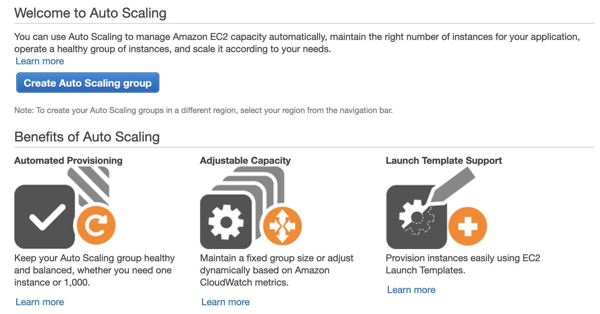
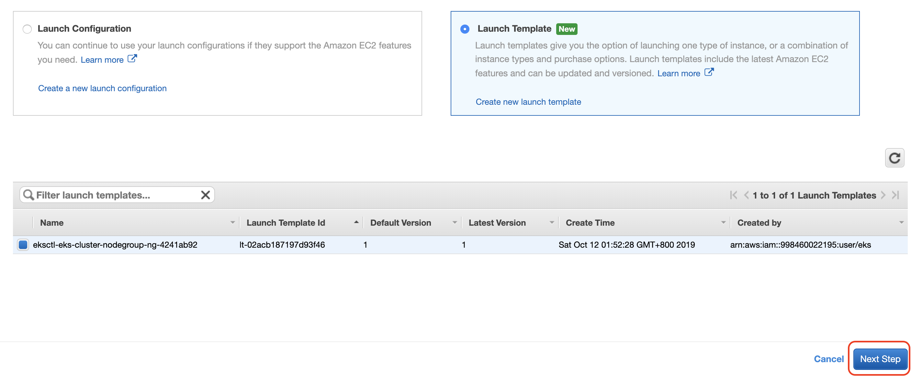
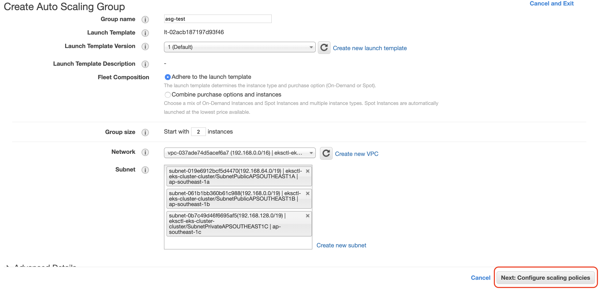
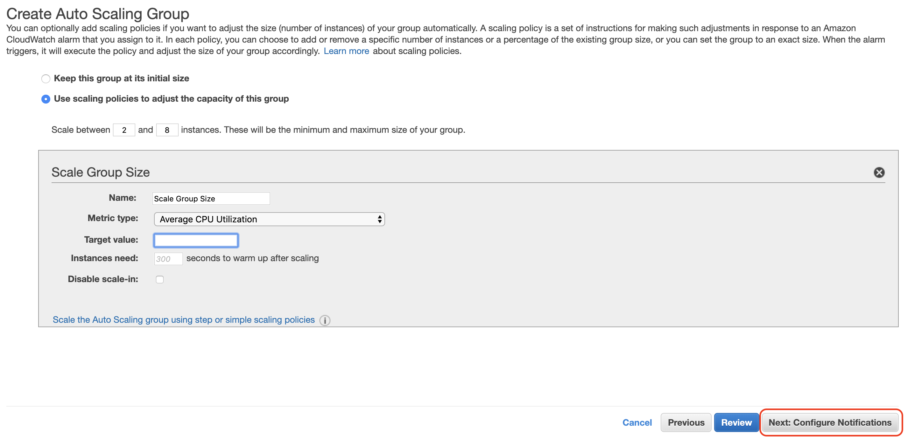
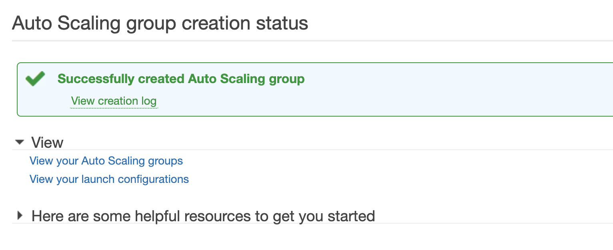
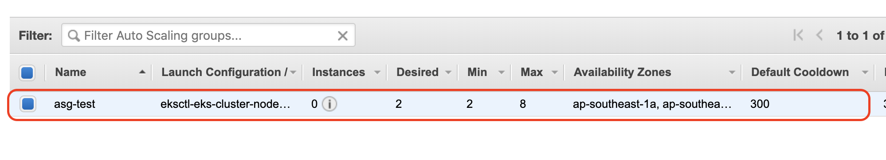
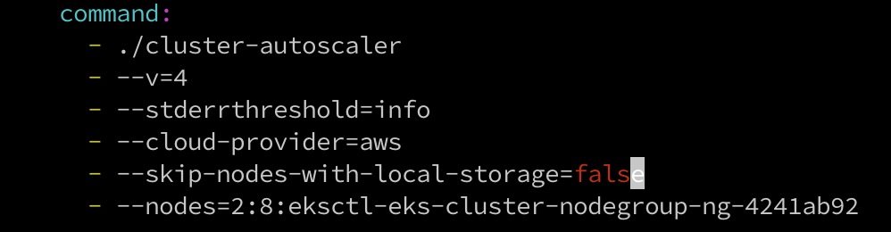
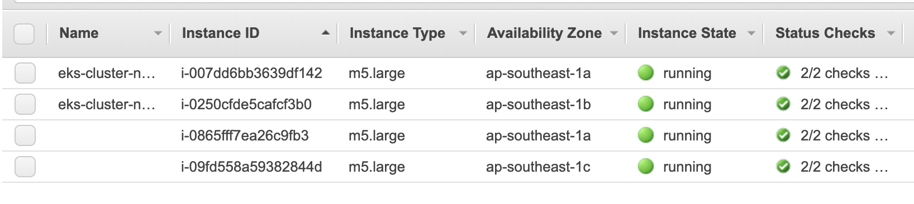

# [Day27] k8s應用篇（一）：Helm部署apps、HPA和CA

Author: Nick Zhuang
Type: kubernetes

# 前言

今天開始我們會提些在AWS上可以做k8s的應用，應用篇的部分分為上下兩篇。

應用篇（上）：Helm部署apps、HPA與CA的使用（今天）

應用篇（下）：EBS與EFS的操作比較（明天）

~~這裡沒有複習篇了XD，有沒有很開心？~~

廢話不多說，我們就開始吧！

# Helm部署apps

要使用Helm，那麼我們就要先安裝Helm

複習傳送門：[[Day18] k8s之管理篇延伸：兩個H的小故事：Harbor與Helm](https://ithelp.ithome.com.tw/articles/10224116)

## 安裝Helm

下載命令列程式

    $curl -L https://git.io/get_helm.sh | bash
    % Total    % Received % Xferd  Average Speed   Time    Time     Time  Current
                                     Dload  Upload   Total   Spent    Left  Speed
      0     0    0     0    0     0      0      0 --:--:--  0:00:01 --:--:--     0
    100  7034  100  7034    0     0   2868      0  0:00:02  0:00:02 --:--:--  626k
    Downloading https://get.helm.sh/helm-v2.14.3-linux-amd64.tar.gz
    Preparing to install helm and tiller into /usr/local/bin
    [sudo] password for nick:
    helm installed into /usr/local/bin/helm
    tiller installed into /usr/local/bin/tiller
    Run 'helm init' to configure helm.

新增tiller這個namespace

    $kubectl create namespace tiller
    namespace/tiller created

設定環境變數並Export，執行tiller

    $export TILLER_NAMESPACE=tiller
    $tiller -listen=localhost:44134 -storage=secret -logtostderr
    [main] 2019/10/11 19:07:39 Starting Tiller v2.14.3 (tls=false)
    [main] 2019/10/11 19:07:39 GRPC listening on localhost:44134
    [main] 2019/10/11 19:07:39 Probes listening on :44135
    [main] 2019/10/11 19:07:39 Storage driver is Secret
    [main] 2019/10/11 19:07:39 Max history per release is 0

再開另一個新視窗來接續操作：helm初始化與更新

    $export HELM_HOST=:44134
    $helm init --client-only
    Creating /home/nick/.helm
    Creating /home/nick/.helm/repository
    Creating /home/nick/.helm/repository/cache
    Creating /home/nick/.helm/repository/local
    Creating /home/nick/.helm/plugins
    Creating /home/nick/.helm/starters
    Creating /home/nick/.helm/cache/archive
    Creating /home/nick/.helm/repository/repositories.yaml
    Adding stable repo with URL: https://kubernetes-charts.storage.googleapis.com
    Adding local repo with URL: http://127.0.0.1:8879/charts
    $HELM_HOME has been configured at /home/nick/.helm.
    Not installing Tiller due to 'client-only' flag having been set
    $helm repo update
    Hang tight while we grab the latest from your chart repositories...
    ...Skip local chart repository
    ...Successfully got an update from the "stable" chart repository
    Update Complete.

到這邊安裝結束！

## 使用Helm部署apps

這邊假設我們透過CI/CD的方式，已經將應用程序封裝成Image，並上傳至Docker Hub上

### 將Istio部署到k8s

這邊我們可以使用Istio，一個開源套件

接著我們透過helm來部署它囉！

    $wget https://github.com/istio/istio/releases/download/1.3.1/istio-1.3.1-linux.tar.gz
    $tar xf istio-1.3.1-linux.tar.gz
    $cd istio-1.3.1/
    $ls
    bin  install  istio.VERSION  LICENSE  README.md  samples  tools
    $helm install install/kubernetes/helm/istio-init --name istio-init --namespace istio-system
    NAME:   istio-init
    LAST DEPLOYED: Fri Oct 11 20:12:25 2019
    NAMESPACE: istio-system
    STATUS: DEPLOYED
    
    RESOURCES:
    ==> v1/ClusterRole
    NAME                     AGE
    istio-init-istio-system  2s
    
    ==> v1/ClusterRoleBinding
    NAME                                        AGE
    istio-init-admin-role-binding-istio-system  2s
    
    ==> v1/ConfigMap
    NAME          DATA  AGE
    istio-crd-10  1     3s
    istio-crd-11  1     3s
    istio-crd-12  1     2s
    
    ==> v1/Job
    NAME                     COMPLETIONS  DURATION  AGE
    istio-init-crd-10-1.3.1  0/1          2s        2s
    istio-init-crd-11-1.3.1  0/1          2s        2s
    istio-init-crd-12-1.3.1  0/1          2s        2s
    
    ==> v1/Pod(related)
    NAME                           READY  STATUS             RESTARTS  AGE
    istio-init-crd-10-1.3.1-ptp6m  0/1    ContainerCreating  0         2s
    istio-init-crd-11-1.3.1-k6n67  0/1    ContainerCreating  0         2s
    istio-init-crd-12-1.3.1-9tgpt  0/1    ContainerCreating  0         2s
    
    ==> v1/ServiceAccount
    NAME                        SECRETS  AGE
    istio-init-service-account  1        2s

OK，看起來沒啥問題，我們已經成功安裝了Istio這個套件，它具有管理與監控微服務的功能。

原來的視窗可以看到log喔！~~（沒有手殘把它關掉吧？~~

    [tiller] 2019/10/11 20:12:23 preparing install for istio-init
    [storage] 2019/10/11 20:12:23 getting release history for "istio-init"
    [tiller] 2019/10/11 20:12:25 rendering istio-init chart using values
    2019/10/11 20:12:25 info: manifest "istio-init/templates/job-crd-certmanager-10.yaml" is empty. Skipping.
    2019/10/11 20:12:25 info: manifest "istio-init/templates/configmap-crd-certmanager-11.yaml" is empty. Skipping.
    2019/10/11 20:12:25 info: manifest "istio-init/templates/configmap-crd-certmanager-10.yaml" is empty. Skipping.
    2019/10/11 20:12:25 info: manifest "istio-init/templates/job-crd-certmanager-11.yaml" is empty. Skipping.
    [tiller] 2019/10/11 20:12:25 performing install for istio-init
    [tiller] 2019/10/11 20:12:25 executing 0 crd-install hooks for istio-init
    [tiller] 2019/10/11 20:12:25 hooks complete for crd-install istio-init
    [tiller] 2019/10/11 20:12:25 executing 0 pre-install hooks for istio-init
    [tiller] 2019/10/11 20:12:25 hooks complete for pre-install istio-init
    [storage] 2019/10/11 20:12:25 getting release history for "istio-init"
    [storage] 2019/10/11 20:12:25 creating release "istio-init.v1"
    [kube] 2019/10/11 20:12:25 building resources from manifest
    [kube] 2019/10/11 20:12:25 creating 9 resource(s)
    [tiller] 2019/10/11 20:12:26 executing 0 post-install hooks for istio-init
    [tiller] 2019/10/11 20:12:26 hooks complete for post-install istio-init
    [storage] 2019/10/11 20:12:26 updating release "istio-init.v1"
    [storage] 2019/10/11 20:12:26 getting last revision of "istio-init"
    [storage] 2019/10/11 20:12:26 getting release history for "istio-init"
    [kube] 2019/10/11 20:12:26 Doing get for ConfigMap: "istio-crd-10"
    [kube] 2019/10/11 20:12:26 get relation pod of object: istio-system/ConfigMap/istio-crd-10
    [kube] 2019/10/11 20:12:26 Doing get for ConfigMap: "istio-crd-11"
    [kube] 2019/10/11 20:12:27 get relation pod of object: istio-system/ConfigMap/istio-crd-11
    [kube] 2019/10/11 20:12:27 Doing get for ConfigMap: "istio-crd-12"
    [kube] 2019/10/11 20:12:27 get relation pod of object: istio-system/ConfigMap/istio-crd-12
    [kube] 2019/10/11 20:12:27 Doing get for ServiceAccount: "istio-init-service-account"
    [kube] 2019/10/11 20:12:27 get relation pod of object: istio-system/ServiceAccount/istio-init-service-account
    [kube] 2019/10/11 20:12:27 Doing get for ClusterRole: "istio-init-istio-system"
    [kube] 2019/10/11 20:12:27 get relation pod of object: /ClusterRole/istio-init-istio-system
    [kube] 2019/10/11 20:12:27 Doing get for ClusterRoleBinding: "istio-init-admin-role-binding-istio-system"
    [kube] 2019/10/11 20:12:27 get relation pod of object: /ClusterRoleBinding/istio-init-admin-role-binding-istio-system
    [kube] 2019/10/11 20:12:27 Doing get for Job: "istio-init-crd-10-1.3.1"
    [kube] 2019/10/11 20:12:27 get relation pod of object: istio-system/Job/istio-init-crd-10-1.3.1
    [kube] 2019/10/11 20:12:27 Doing get for Job: "istio-init-crd-11-1.3.1"
    [kube] 2019/10/11 20:12:27 get relation pod of object: istio-system/Job/istio-init-crd-11-1.3.1
    [kube] 2019/10/11 20:12:27 Doing get for Job: "istio-init-crd-12-1.3.1"
    [kube] 2019/10/11 20:12:28 get relation pod of object: istio-system/Job/istio-init-crd-12-1.3.1

好了就將它恢復原狀吧～

    $helm delete --purge istio-init
    release "istio-init" deleted
    $kubectl delete namespace istio-system
    namespace "istio-system" deleted

接著我們看下個主題囉

# HPA（Horizontal Pod Autoscaling）

## 前置準備：安裝metrics-server

需要先透過Helm安裝metrics-server（記得log視窗要保留

    $helm install stable/metrics-server \
          --name metrics-server \
          --version 2.0.4 \
          --namespace metrics
    NAME:   metrics-server
    LAST DEPLOYED: Fri Oct 11 20:55:34 2019
    NAMESPACE: metrics
    STATUS: DEPLOYED
    
    RESOURCES:
    ==> v1/ClusterRole
    NAME                   AGE
    system:metrics-server  2s
    
    ==> v1/ClusterRoleBinding
    NAME                                  AGE
    metrics-server:system:auth-delegator  2s
    system:metrics-server                 2s
    
    ==> v1/Pod(related)
    NAME                             READY  STATUS             RESTARTS  AGE
    metrics-server-5b5bfd85cf-rszzh  0/1    ContainerCreating  0         1s
    
    ==> v1/Service
    NAME            TYPE       CLUSTER-IP      EXTERNAL-IP  PORT(S)  AGE
    metrics-server  ClusterIP  10.100.213.252  <none>       443/TCP  1s
    
    ==> v1/ServiceAccount
    NAME            SECRETS  AGE
    metrics-server  1        2s
    
    ==> v1beta1/APIService
    NAME                    AGE
    v1beta1.metrics.k8s.io  1s
    
    ==> v1beta1/RoleBinding
    NAME                        AGE
    metrics-server-auth-reader  2s
    
    ==> v1beta2/Deployment
    NAME            READY  UP-TO-DATE  AVAILABLE  AGE
    metrics-server  0/1    1           0          1s

驗證一下安裝

    $kubectl get apiservice v1beta1.metrics.k8s.io -o yaml
    apiVersion: apiregistration.k8s.io/v1
    kind: APIService
    metadata:
      creationTimestamp: "2019-10-11T12:55:36Z"
      labels:
        app: metrics-server
        chart: metrics-server-2.0.4
        heritage: Tiller
        release: metrics-server
      name: v1beta1.metrics.k8s.io
      resourceVersion: "12588"
      selfLink: /apis/apiregistration.k8s.io/v1/apiservices/v1beta1.metrics.k8s.io
      uid: 6b2ffabe-ec26-11e9-a272-06cc30a35306
    spec:
      group: metrics.k8s.io
      groupPriorityMinimum: 100
      insecureSkipTLSVerify: true
      service:
        name: metrics-server
        namespace: metrics
      version: v1beta1
      versionPriority: 100
    status:
      conditions:
      - lastTransitionTime: "2019-10-11T12:55:40Z"
        message: all checks passed
        reason: Passed
        status: "True"
        type: Available

OK，看起來沒問題

## 啟動HPA並測試

啟動Deployment，測試用，每個Pod會佔用cpu一部份的資源，並開放80端口

    $kubectl run php-apache --image=k8s.gcr.io/hpa-example --requests=cpu=200m --expose --port=80
    service/php-apache created
    deployment.apps/php-apache created

啟動HPA，以cpu百分之五十為基準Scale up，最小數量1，最大Scale到10

    $kubectl autoscale deployment php-apache --cpu-percent=50 --min=1 --max=10
    horizontalpodautoscaler.autoscaling/php-apache autoscaled

檢查HPA狀態，等它沒有Unknown我們再繼續

    $kubectl get hpa
    NAME         REFERENCE               TARGETS         MINPODS   MAXPODS   REPLICAS   AGE
    php-apache   Deployment/php-apache   <unknown>/50%   1         10        0          9s
    $kubectl get hpa
    NAME         REFERENCE               TARGETS         MINPODS   MAXPODS   REPLICAS   AGE
    php-apache   Deployment/php-apache   <unknown>/50%   1         10        1          89s
    $kubectl get hpa
    NAME         REFERENCE               TARGETS   MINPODS   MAXPODS   REPLICAS   AGE
    php-apache   Deployment/php-apache   0%/50%    1         10        1          103s

如果沒裝前面的metric-server，會一直是Unknown的狀態，請特別注意

接著我們開啟一個busybox，並在裡面下指令如下

    $kubectl run -i --tty load-generator --image=busybox /bin/sh
    / # while true; do wget -q -O - http://php-apache; done

這時候應該會顯示如下

    OK!OK!OK!OK!OK!OK!OK!OK!OK!OK!OK!OK!OK!OK!OK!OK!OK!OK!OK!OK!OK!OK!OK!OK!OK!OK!OK!OK!OK!OK!OK!OK!OK!

接著開另一個視窗，檢查HPA狀態

    $kubectl get hpa -w
    NAME         REFERENCE               TARGETS   MINPODS   MAXPODS   REPLICAS   AGE
    php-apache   Deployment/php-apache   0%/50%    1         10        1          3m6s
    php-apache   Deployment/php-apache   483%/50%  1         10        1          3m31s
    php-apache   Deployment/php-apache   483%/50%  1         10        4          3m46s
    php-apache   Deployment/php-apache   483%/50%  1         10        8          4m1s
    php-apache   Deployment/php-apache   483%/50%  1         10        10         4m16s
    php-apache   Deployment/php-apache   51%/50%   1         10        10         4m31s
    php-apache   Deployment/php-apache   0%/50%    1         10        10         5m31s
    php-apache   Deployment/php-apache   0%/50%    1         10        10         10m
    php-apache   Deployment/php-apache   0%/50%    1         10        1          10m

可以發現它會自動Scale up到10個，我們取消OK的話，它會慢慢恢復原狀。

OK，測試結束囉～

# CA（Cluster AutoScaler）

這是所謂的群集自動拓展器，當集群內負載過重的時候，就可以自動拓展節點，也就是Slave，進而降低群集的整體負擔唷！

## 下載CA設定

    $mkdir ca
    $cd ca
    $wget https://eksworkshop.com/scaling/deploy_ca.files/cluster_autoscaler.yml

等下ASG創好後，需將該YAML中的AUTOSCALING GROUP NAME替換掉

## 建立ASG（Auto Scaling Group）

從[這裡](https://ap-southeast-1.console.aws.amazon.com/ec2/autoscaling/home?region=ap-southeast-1#AutoScalingGroups:id=;filter=eksworkshop;view=details)開始設置，Create Auto Scaling group

接著選擇Launch Template，Next

再來設置一些對應參數，好了下一步

然後設定Scaling的條件，這裡是CPU使用率50以上

好了就下一步，直接都Next，成功創建會長這樣

可以在ASG的面板看已經有的ASG狀態

因為這裡是設置`eksctl-eks-cluster-nodegroup-ng-4241ab92`，要將這名稱放到剛剛的YAML中

設置集群環境變數

    $STACK_NAME=$(eksctl get nodegroup --cluster eks-cluster -o json | jq -r '.[].StackName')
    $INSTANCE_PROFILE_ARN=$(aws cloudformation describe-stacks --stack-name $STACK_NAME | jq -r '.Stacks[].Outputs[] | select(.OutputKey=="InstanceProfileARN") | .OutputValue')
    $ROLE_NAME=$(aws cloudformation describe-stacks --stack-name $STACK_NAME | jq -r '.Stacks[].Outputs[] | select(.OutputKey=="InstanceRoleARN") | .OutputValue' | cut -f2 -d/)

檢視變數

    $echo $STACK_NAME
    eksctl-eks-cluster-nodegroup-ng-4241ab92
    $echo $ROLE_NAME
    eksctl-eks-cluster-nodegroup-ng-4-NodeInstanceRole-1KCFHMZZOZZED

建立ASG Policy

    $mkdir asg_policy
    $vim asg_policy/k8s-asg-policy.json
    {
      "Version": "2012-10-17",
      "Statement": [
        {
          "Effect": "Allow",
          "Action": [
            "autoscaling:DescribeAutoScalingGroups",
            "autoscaling:DescribeAutoScalingInstances",
            "autoscaling:SetDesiredCapacity",
            "autoscaling:TerminateInstanceInAutoScalingGroup",
            "autoscaling:DescribeTags"
          ],
          "Resource": "*"
        }
      ]
    }

套用ASG Policy

    $aws iam put-role-policy --role-name $ROLE_NAME --policy-name ASG-Policy-For-Worker --policy-document file://asg_policy/k8s-asg-policy.json

驗證ASG Policy

    $aws iam get-role-policy --role-name $ROLE_NAME --policy-name ASG-Policy-For-Worker
    {
        "PolicyName": "ASG-Policy-For-Worker",
        "RoleName": "eksctl-eks-cluster-nodegroup-ng-4-NodeInstanceRole-1KCFHMZZOZZED",
        "PolicyDocument": {
            "Version": "2012-10-17",
            "Statement": [
                {
                    "Resource": "*",
                    "Effect": "Allow",
                    "Action": [
                        "autoscaling:DescribeAutoScalingGroups",
                        "autoscaling:DescribeAutoScalingInstances",
                        "autoscaling:SetDesiredCapacity",
                        "autoscaling:TerminateInstanceInAutoScalingGroup",
                        "autoscaling:DescribeTags"
                    ]
                }
            ]
        }
    }

套用CA設定

    $kubectl apply -f cluster_autoscaler.yml
    serviceaccount/cluster-autoscaler created
    clusterrole.rbac.authorization.k8s.io/cluster-autoscaler created
    role.rbac.authorization.k8s.io/cluster-autoscaler created
    clusterrolebinding.rbac.authorization.k8s.io/cluster-autoscaler created
    rolebinding.rbac.authorization.k8s.io/cluster-autoscaler created
    deployment.extensions/cluster-autoscaler created

可以看log

    $kubectl logs -f deployment/cluster-autoscaler -n kube-system

新增一個nginx的YAML

    $vim nginx.yaml
    apiVersion: extensions/v1beta1
    kind: Deployment
    metadata:
      name: nginx-to-scaleout
    spec:
      replicas: 1
      template:
        metadata:
          labels:
            service: nginx
            app: nginx
        spec:
          containers:
          - image: nginx
            name: nginx-to-scaleout
            resources:
              limits:
                cpu: 500m
                memory: 512Mi
              requests:
                cpu: 500m
                memory: 512Mi

套用nginx

    $kubectl apply -f nginx.yaml
    deployment.extensions/nginx-to-scaleout created
    $kubectl get deploy
    NAME                READY   UP-TO-DATE   AVAILABLE   AGE
    nginx-to-scaleout   1/1     1            1           21s

接著我們Scale up

    $kubectl scale --replicas=10 deployment/nginx-to-scaleout
    deployment.extensions/nginx-to-scaleout scaled

檢查Pod狀態

    $kubectl get po
    NAME                                 READY   STATUS              RESTARTS   AGE
    nginx-to-scaleout-5bd9d899c7-4jgwd   0/1     ContainerCreating   0          9s
    nginx-to-scaleout-5bd9d899c7-9bjh8   0/1     Pending             0          9s
    nginx-to-scaleout-5bd9d899c7-9cvv4   1/1     Running             0          9s
    nginx-to-scaleout-5bd9d899c7-cttmv   0/1     Pending             0          9s
    nginx-to-scaleout-5bd9d899c7-k9222   0/1     Pending             0          9s
    nginx-to-scaleout-5bd9d899c7-rlwfh   1/1     Running             0          9s
    nginx-to-scaleout-5bd9d899c7-svp9w   0/1     ContainerCreating   0          9s
    nginx-to-scaleout-5bd9d899c7-ttd27   1/1     Running             0          71s
    nginx-to-scaleout-5bd9d899c7-vhhh4   0/1     ContainerCreating   0          9s

接著我們看下EC2的Dashboard

可以注意到多了兩個Node，這是CA造成的結果！

好了我們將它恢復原狀

    $kubectl delete -f cluster_autoscaler.yml
    serviceaccount "cluster-autoscaler" deleted
    clusterrole.rbac.authorization.k8s.io "cluster-autoscaler" deleted
    role.rbac.authorization.k8s.io "cluster-autoscaler" deleted
    clusterrolebinding.rbac.authorization.k8s.io "cluster-autoscaler" deleted
    rolebinding.rbac.authorization.k8s.io "cluster-autoscaler" deleted
    $kubectl delete -f nginx.yaml
    deployment.extensions "nginx-to-scaleout" deleted

OK，測試成功～

# 小結

今天我們學習到了如何安裝Helm，並透過Helm去部署我們的應用。再來是HPA及CA的部分，HPA透過Scale up Pod而能有效的平均分攤k8s元件的loading，CA則是透過Scale up Node而能有效的降低對單個節點上的負擔，這兩個功能算蠻實用的個人覺得。明天會介紹EBS及EFS的使用，並比較兩者的差異，我們明天見！

# 參考資料

- [Helm安裝](https://github.com/pahud/amazon-eks-workshop/blob/master/00-getting-started/installing-helm.md)
- [Helm使用](https://istio.io/docs/setup/install/helm/)
- [HPA設置](https://eksworkshop.com/scaling/deploy_hpa/)
- [HPA部署app測試](https://eksworkshop.com/scaling/test_hpa/)
- [CA設置與驗證](https://eksworkshop.com/scaling/deploy_ca/)
