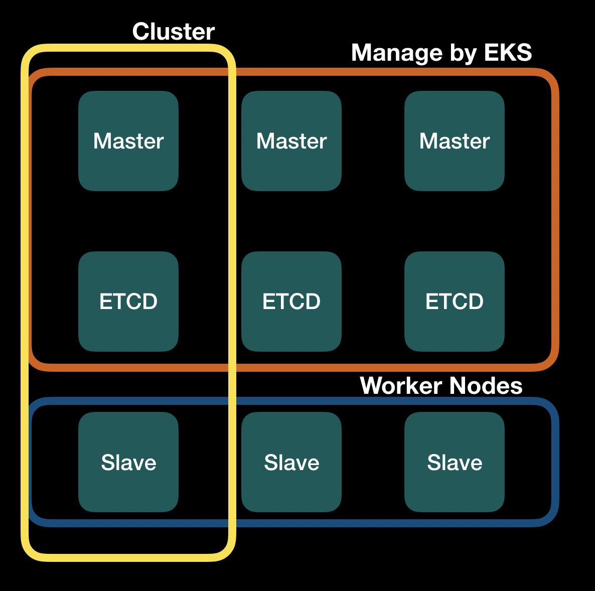
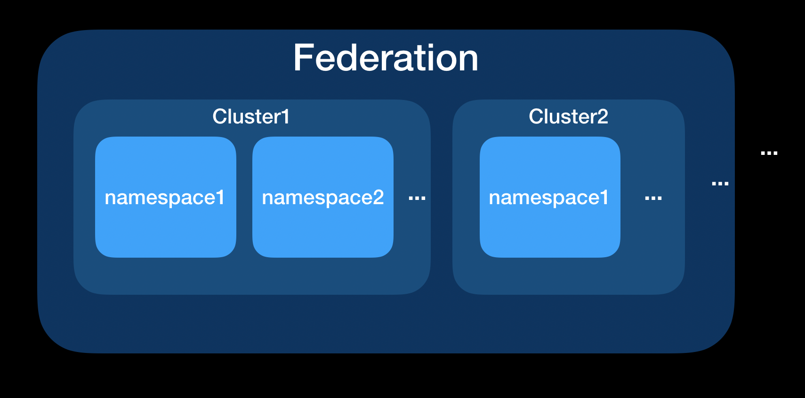

# [Day29] k8s集群篇：HA、Federation

Author: Nick Zhuang
Type: kubernetes

# 前言

今天我們要來探討一下群集相關的操作，在前些時候有提到過HA的觀念，這邊會對比minikube與AWS做個整合性的說明。再來就是跨集群的溝通部分了，這裡將會實作一個Federation，並將一個Deployment部署到兩個不同的cluster上。

# HA

HA（High Availability），是指高可用性，它可以用在主節點的備援上，因為minikube是單節點的cluster，所以它沒法設置，EKS的話就可以，但我們也不需特別去設置它，因為在AWS上的EKS，主節點的管理是在EKS內進行的，底下看個架構圖：

可以看到EKS會自動幫我們把Master和ETCD自動Scale up成3個，我們能控制的只有藍色區塊的部分

當我們正在使用的Master掛掉的時候，這時候EKS就會自動幫我們把備援的主節點換上去，它會始終讓主節點數保持3個，這個3是要達成HA的基本要件。

這邊我們不用實作，因為EKS都已經幫我們做好了，而且要升版的時候，它也能夠自動幫我們完成喔！很方便吧？

# Federation

Federation（聯邦）自開始出現後一直都是讓人很感興趣的議題，不過因為v1的版本架構設計瑕疵，目前已經被棄用，現在是直接用v2版，比較符合現有的k8s架構需求，底下我們操作下，看看怎麼使用，也比較下minikube與EKS這兩個不同的環境使用上有何不同。

## Minikube的安裝與使用

下載Kubefed主程式，從[這裡](https://github.com/kubernetes-sigs/kubefed/releases/)下載

### 設置主程式

    $tar -zxvf kubefedctl-*.tgz
    $chmod u+x kubefedctl
    $sudo mv kubefedctl /usr/local/bin/ # make sure the location is in the PATH

注意到這個只有支援linxu和OSX，筆者是用Mac

接著我們新增兩個minikube的群集（要開啟RBAC

    $minikube start -p cluster1 --kubernetes-version v1.13.4 --extra-config=apiserver.Authorization.Mode=RBAC
    $minikube start -p cluster2 --kubernetes-version v1.13.4 --extra-config=apiserver.Authorization.Mode=RBAC

檢查一下

    $kubectl get all
    NAME                 TYPE        CLUSTER-IP   EXTERNAL-IP   PORT(S)   AGE
    service/kubernetes   ClusterIP   10.96.0.1    <none>        443/TCP   4m6s

如果要切換群集的話

    $kubectl config use-context cluster1
    Switched to context "cluster1".
    $kubectl config use-context cluster2
    Switched to context "cluster2".
    $kubectl config current-context
    cluster2

設置Helm

    $helm repo add kubefed-charts https://raw.githubusercontent.com/kubernetes-sigs/kubefed/master/charts
    $helm repo list
    NAME            URL
    stable          https://kubernetes-charts.storage.googleapis.com
    local           http://127.0.0.1:8879/charts
    istio.io        https://storage.googleapis.com/istio-release/releases/1.3.1/charts/
    kubefed-charts  https://raw.githubusercontent.com/kubernetes-sigs/kubefed/master/charts

檢查對應版本

    $helm search kubefed
    NAME                            CHART VERSION   APP VERSION     DESCRIPTION
    kubefed-charts/kubefed          0.1.0-rc6                       KubeFed helm chart
    kubefed-charts/federation-v2    0.0.10                          Kubernetes Federation V2 helm chart

RBAC設置

    $vim rbac.yaml
    apiVersion: v1
    kind: ServiceAccount
    metadata:
      name: tiller
      namespace: kube-system
    ---
    apiVersion: rbac.authorization.k8s.io/v1
    kind: ClusterRoleBinding
    metadata:
      name: tiller
    roleRef:
      apiGroup: rbac.authorization.k8s.io
      kind: ClusterRole
      name: cluster-admin
    subjects:
      - kind: ServiceAccount
        name: tiller
        namespace: kube-system

套用設定

    $kubectl apply -f rbac.yaml
    role.rbac.authorization.k8s.io/tiller created

Helm初始化

    $helm init --service-account tiller

透過Helm安裝

    $helm install kubefed-charts/kubefed --name kubefed --version=0.1.0-rc6 --namespace kube-system

接著我們把這兩個集群加到Federation中

    $kubefedctl join cluster1 --cluster-context cluster1 \
        --host-cluster-context cluster1 --v=2
    $kubefedctl join cluster2 --cluster-context cluster2 \
        --host-cluster-context cluster1 --v=2

檢查federation狀態

    $kubectl -n kube-federation-system get kubefedclusters
    NAME       READY   AGE
    cluster1   True    1m
    cluster2   True    1m

新增一個Namespace，測試用

    $kubectl create namespace test
    namespace/test created

新增一個Federation的Namespace

    $vim fed-namespace.yaml
    apiVersion: types.kubefed.io/v1beta1
    kind: FederatedNamespace
    metadata:
      name: test
      namespace: test
    spec:
      placement:
        clusters:
        - name: cluster1
        - name: cluster2

調度它

    $kubectl apply -f fed-namespace.yaml
    federatednamespace.types.kubefed.io/test created

部署Deployment

    $vim fed-deployment.yaml
    apiVersion: types.kubefed.io/v1beta1
    kind: FederatedDeployment
    metadata:
      name: test
      namespace: test
    spec:
      template:
        metadata:
          labels:
            app: nginx
        spec:
          replicas: 3
          selector:
            matchLabels:
              app: nginx
          template:
            metadata:
              labels:
                app: nginx
            spec:
              containers:
              - image: nginx
                name: nginx
      placement:
        clusters:
        - name: cluster2
        - name: cluster1
      overrides:
      - clusterName: cluster2
        clusterOverrides:
        - path: "/spec/replicas"
          value: 5
        - path: "/spec/template/spec/containers/0/image"
          value: "nginx:1.17.0-alpine"
        - path: "/metadata/annotations"
          op: "add"
          value:
            foo: bar

我們可以在設定裡面繼承既有的Deployment設定，或是覆寫它，如同replicas中的設置

調度它

    $kubectl apply -f fed-deployment.yaml
    federateddeployment.types.kubefed.io/test created

驗證結果

    $kubectl --context cluster1 -n test get deployments
    NAME   READY   UP-TO-DATE   AVAILABLE   AGE
    test   3/3     3            3           3m
    $kubectl --context cluster2 -n test get deployments
    NAME   READY   UP-TO-DATE   AVAILABLE   AGE
    test   5/5     5            5           3m5s

恢復原狀

    $kubectl delete ns/test
    namespace "test" deleted
    $kubectl --context cluster2 -n test get deployments
    No resources found.

看起來沒啥問題，我們接續看EKS的部分

## EKS的安裝與使用

首先，因為EKS預設是開啟RBAC的，所以我們不需要在這塊再調整參數，以及，因為EKS有使用的特定K8s版本，目前是使用1.13.8，固定的，同樣的也不需要去修改

我們套用前方的設置YAML直接操作，我們直接裝目前最新的、因為是Ubuntu，OS要改成linux

    VERSION=0.1.0-rc6
    OS=linux
    ARCH=amd64
    $curl -LO https://github.com/kubernetes-sigs/kubefed/releases/download/v${VERSION}/kubefedctl-${VERSION}-${OS}-${ARCH}.tgz
    $tar -zxvf kubefedctl-*.tgz
    $chmod u+x kubefedctl
    $sudo mv kubefedctl /usr/local/bin/ # make sure the location is in the PATH

接著用eksctl新增兩個群集

    $eksctl create cluster --name=cluster1 --region=ap-southeast-1
    $eksctl create cluster --name=cluster2 --region=ap-southeast-1

切換群集

    $kubectl config use-context cluster1
    Switched to context "cluster1".
    $kubectl config use-context cluster2
    Switched to context "cluster2".
    $kubectl config current-context
    cluster2

套用RBAC

    $kubectl apply -f rbac.yaml
    role.rbac.authorization.k8s.io/tiller created

Helm初始化

    $helm init --service-account tiller

透過Helm安裝

    $helm install kubefed-charts/kubefed --name kubefed --version=0.1.0-rc6 --namespace kube-system

將這兩個集群加到Federation

    $kubefedctl join cluster1 --cluster-context cluster1 \
        --host-cluster-context cluster1 --v=2
    $kubefedctl join cluster2 --cluster-context cluster2 \
        --host-cluster-context cluster1 --v=2

檢查federation狀態

    $kubectl -n kube-federation-system get kubefedclusters
    NAME       READY   AGE
    cluster1   True    1m10s
    cluster2   True    1m10s

新增一個Namespace，測試用

    $kubectl create namespace test
    namespace/test created

調度Federation的Namespace

    $kubectl apply -f fed-namespace.yaml
    federatednamespace.types.kubefed.io/test created

調度Federation的Deployment

    $kubectl apply -f fed-deployment.yaml
    federateddeployment.types.kubefed.io/test created

驗證結果

    $kubectl --context cluster1 -n test get deployments
    NAME   READY   UP-TO-DATE   AVAILABLE   AGE
    test   3/3     3            3           5m
    $kubectl --context cluster2 -n test get deployments
    NAME   READY   UP-TO-DATE   AVAILABLE   AGE
    test   5/5     5            5           5m20s

恢復原狀

    $kubectl delete ns/test
    namespace "test" deleted
    $kubectl --context cluster2 -n test get deployments
    No resources found.

OK，測試結束了！

# 小結

今天我們理解了HA、Federation的觀念及其所代表的重要性，這兩個的概念都是與備援有關係的，我們看張架構圖：

從Federation看到我們可以把一至多個Cluster（群集）指派給它，在每個Cluster中我們也可以設置多個Namespace（虛擬群集），當然，如果還是不放心的話，我們甚至可以設置多個Federation，達到全方位的控管備援機制。明天就是最後一天啦！會有一整個系列統整的內容帶給大家，敬請期待，我們明天見囉！

# 參考連結

- [用kubeadm實作HA](https://kubernetes.io/docs/setup/production-environment/tools/kubeadm/high-availability/)
- [主節點設置HA](https://kubernetes.io/docs/tasks/administer-cluster/highly-available-master/)
- [HA的Ubuntu實作](https://www.kubeclusters.com/docs/How-to-Deploy-a-Highly-Available-kubernetes-Cluster-with-Kubeadm-on-Ubuntu16)
- [EKS與Federation](https://www.nickaws.net/aws/elixir/2019/09/02/Federation-and-EKS.html)
- [EKS介紹](https://kkc.github.io/2018/10/04/EKS-notes/)
- [kubefed的Ingress](https://github.com/kubernetes-sigs/kubefed/blob/master/docs/ingress-service-dns-with-coredns.md)
- [kubefed的Helm](https://github.com/kubernetes-sigs/kubefed/blob/master/charts/kubefed/README.md)
- [kubefed的安裝](https://github.com/kubernetes-sigs/kubefed/blob/master/docs/installation.md)
- [kubefed的使用](https://github.com/kubernetes-sigs/kubefed/blob/master/docs/userguide.md)
