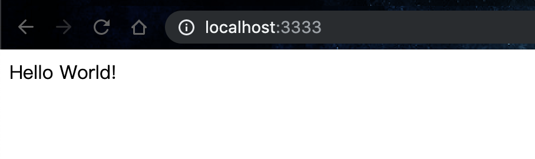

# [Day3] k8s的小型測試環境：minikube安裝與使用，簡易驗證yaml的正確性

Author: Nick Zhuang
Type: docker,kubernetes

# 前言

小小複習完Docker的內容後，接著我們要架設簡易版的k8s環境，幫助我們在上線前有個簡單的測試環境可以去驗證我們的服務，這個套件，就是minikube。

# minikube的安裝

因為筆者是用mac的環境下去開發的，接下來的示範會以mac為主，如果是用其他作業系統的朋友，可以參考下方的連結，只要滿足對應條件，minikube除了可以在mac上跑之外，也能在linux和windows上面跑。

## 1.  檢查macOS是否支持虛擬化

    sysctl -a | grep -E --color 'machdep.cpu.features|VMX'

有支援的情況下會有類似顯示

    machdep.cpu.features: FPU VME DE PSE TSC MSR PAE MCE CX8 APIC SEP MTRR PGE MCA CMOV PAT PSE36 CLFSH DS ACPI MMX 
    FXSR SSE SSE2 SS HTT TM PBE SSE3 PCLMULQDQ DTES64 MON DSCPL VMX SMX EST TM2 SSSE3 FMA CX16 TPR PDCM SSE4.1 SSE4.2 
    x2APIC MOVBE POPCNT AES PCID XSAVE OSXSAVE SEGLIM64 TSCTMR AVX1.0 RDRAND F16C

## 2.  安裝kubectl

### 方法一：使用curl安裝

- 下載安裝包
```
curl -LO https://storage.googleapis.com/kubernetes-release/release/$(curl -s https://storage.googleapis.com/kubernetes-release/release/stable.txt)/bin/darwin/amd64/kubectl
```
- 賦予kubectl執行的權限
```
chmod +x ./kubectl
```
- 將kubectl置於系統預設執行路徑底下
```
sudo mv ./kubectl /usr/local/bin/kubectl
```
### 方法二：使用homebrew安裝（推

homebrew是macOS常用的套件管理程式，用這個去安裝會非常簡單

- 下homebrew的指令安裝kubectl
```
brew install kubernetes-cli
```
## 3.  安裝虛擬機

筆者是用免費的VirtualBox，下載dmg檔並安裝就可以

## 4.  安裝minikube

### 方法一：使用curl安裝

    curl -Lo minikube https://storage.googleapis.com/minikube/releases/latest/minikube-darwin-amd64 \
      && chmod +x minikube
    sudo mv minikube /usr/local/bin

### 方法二：使用homebrew安裝（推

    brew cask install minikube

# minikube使用

## 1.  啟動minikube

    minikube start

應該要顯示類似以下訊息

    o   minikube v0.35.0 on darwin (amd64)
    i   Tip: Use 'minikube start -p <name>' to create a new cluster, or 'minikube delete' to delete this one.
    :   Restarting existing virtualbox VM for "minikube" ...
    :   Waiting for SSH access ...
    -   "minikube" IP address is 192.168.99.100
    -   Configuring Docker as the container runtime ...
    -   Preparing Kubernetes environment ...
    -   Pulling images required by Kubernetes v1.13.4 ...
    :   Relaunching Kubernetes v1.13.4 using kubeadm ...
    :   Waiting for pods: apiserver proxy etcd scheduler controller addon-manager dns
    :   Updating kube-proxy configuration ...
    -   Verifying component health ......
    +   kubectl is now configured to use "minikube"
    =   Done! Thank you for using minikube!

## 2.  執行kubectl並驗證

### 安裝後，驗證kubectl版本

    kubectl version

如果出現以下類似訊息

    Client Version: version.Info{Major:"1", Minor:"14", GitVersion:"v1.14.0", GitCommit:"641856db18352033a0d96dbc99153fa3b27298e5", GitTreeState:"clean", BuildDate:"2019-03-26T00:04:52Z", GoVersion:"go1.12.1", Compiler:"gc", Platform:"darwin/amd64"}
    Server Version: version.Info{Major:"1", Minor:"13", GitVersion:"v1.13.4", GitCommit:"c27b913fddd1a6c480c229191a087698aa92f0b1", GitTreeState:"clean", BuildDate:"2019-02-28T13:30:26Z", GoVersion:"go1.11.5", Compiler:"gc", Platform:"linux/amd64"}

代表啟動成功，可以正常使用kubectl！

### 檢查叢集狀態

    kubectl get all

應該要顯示

    NAME                 TYPE        CLUSTER-IP   EXTERNAL-IP   PORT(S)   AGE
    service/kubernetes   ClusterIP   10.96.0.1    <none>        443/TCP   154d

### 接著我們編輯一個簡單的YAML

    vim pod-demo.yaml

輸入以下內容

    apiVersion: v1
    kind: Pod
    metadata:
      name: my-helloworld
      labels:
        app: helloworld
    spec:
      containers:
      - name: k8s-demo
        image: 105552010/k8s-demo
        ports:
        - name: nodejs-port
          containerPort: 3000

簡易說明下這個檔案的格式內容：

`apiVersion` : API的版本

`kind` : 物件的種類，物件我們前面有提過分為Basic和Advance，這邊是Basic的Pod，詳細後面會介紹

`metadata` : name是指pod的名稱、label是用來標記物件的，在管理的時候方便控管

`spec` : name定義定義container的名稱、image定義使用的鏡像、port是指它開放的port

### 開啟一個pod

    kubectl apply -f pod-demo.yaml

應要顯示下方訊息為成功

    pod/my-helloworld created

我們可以用describe去檢查他的狀態

    kubectl describe po my-helloworld

應顯示類似訊息（只貼最後內容，這很詳細，debug很好用

    Events:
      Type    Reason     Age   From               Message
      ----    ------     ----  ----               -------
      Normal  Scheduled  65s   default-scheduler  Successfully assigned default/my-helloworld to minikube
      Normal  Pulling    65s   kubelet, minikube  pulling image "105552010/k8s-demo"
      Normal  Pulled     56s   kubelet, minikube  Successfully pulled image "105552010/k8s-demo"
      Normal  Created    56s   kubelet, minikube  Created container
      Normal  Started    56s   kubelet, minikube  Started container

或是用logs去看日誌紀錄

    kubectl logs my-helloworld 

應該顯示類似訊息

    npm info it worked if it ends with ok
    npm info using npm@2.15.11
    npm info using node@v4.6.2
    npm info prestart myapp@0.0.1
    npm info start myapp@0.0.1
    
    > myapp@0.0.1 start /app
    > node index.js
    
    Example app listening at http://:::3000

### 透過瀏覽器連接pod

    kubectl port-forward my-helloworld 3333:3000

這時候它應該會卡在命令列，顯示如下：

    Forwarding from 127.0.0.1:3333 -> 3000
    Forwarding from [::1]:3333 -> 3000

打開瀏覽器，這時候可以看到



再按Crtl+C結束執行，大功告成！

如果要刪除這個pod

    kubectl delete -f pod-demo.yaml

另外，當我們集群沒有要使用的時候，我們可以這樣做

    minikube stop

如果顯示：

    :   Stopping "minikube" in virtualbox ...
    -   "minikube" stopped.

這樣就把集群關掉啦～

# 小結

今天我們學到了如何安裝minikube，這是一個小型的k8s群集，我們可以藉由這個環境去簡單的去驗證我們要開在container裡面的程序，透過這個環境驗證後，我們就能考慮將我們的程序上線測試，無論是上公有雲或是私有雲都可以，minikube這個環境後續會持續用到，當然簡易的pod驗證是可以不用透過forward的，有更好用的方式，就是Service，這部分會在基礎篇談到，敬請期待！我們明天見～

# 參考資料

- [minikube安裝](https://kubernetes.io/docs/tasks/tools/install-minikube/)
- [簡易版pod驗證](https://medium.com/@wrre/kubernetes%E5%AD%B8%E7%BF%92%E7%AD%86%E8%A8%982-%E5%BB%BA%E7%AB%8B%E8%87%AA%E5%B7%B1%E7%9A%84pod-a240f8a00a40)

