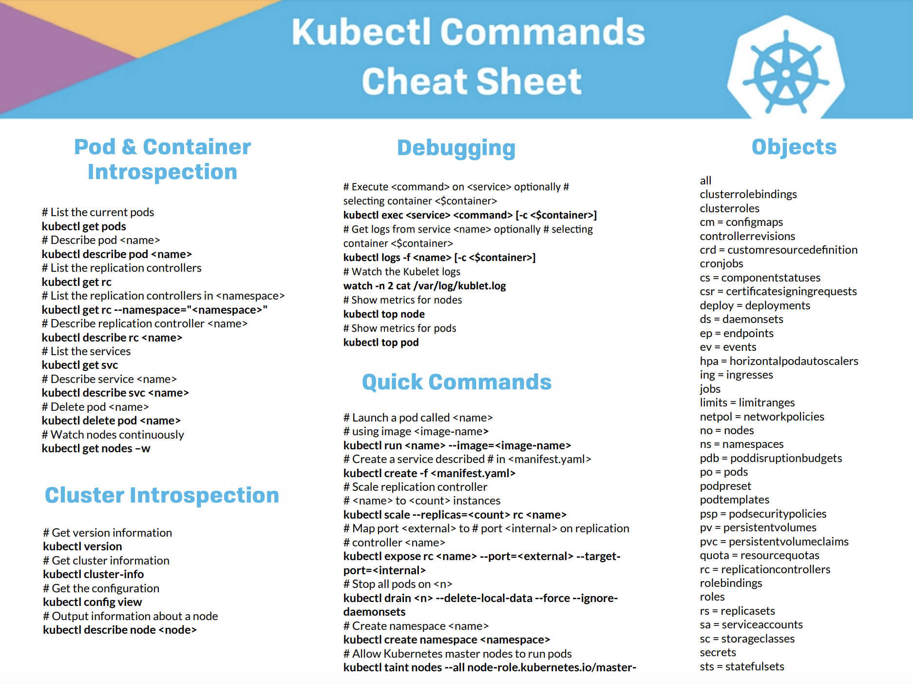

# [Day4] 碼頭工的日常與舵手的逆襲：Docker與k8s常用指令集比較

Author: Nick Zhuang
Type: kubernetes

# 前言

既然第二天我們已經快速瀏覽過Docker的基本指令，那我們就應該要知道在k8s中我們有哪些Docker用到的指令可以沿用，同時透過這樣的方式用另外一個面向去了解k8s。

# k8s的常用工具

一般來說，k8s在master node上有3個工具可以使用：

- kubectl
- kubeadm
- kubelet

kubectl是這篇介紹的主軸，他有些指令參數跟docker是相通的，他是一項k8s的管理工具。

kubeadm是k8s官方推出的部署工具，該工具實作類似Docker swarm一樣的部署方式。

kubelet是在每個節點上運行的主要"節點代理"，並適用於描述pod的YAML或JSON物件。

# kubectl指令一覽

我們來小小複習一下docker，以下是有關kubectl重疊的部分

    #啟動容器
    docker run -it --name web alpine:3.4 bash
    #列出執行的容器
    docker ps
    #執行一個已經存在的容器
    docker exec -it web bash
    #連上一個已經在執行程序的容器
    docker attach -it web
    #檢查容器的log
    docker logs -f web
    #停止容器並移除
    docker stop web
    docker rm web
    #登入，可以是Docker hub或是private registry
    docker login my.registry.com:8000
    #顯示docker的版本號
    docker version
    #獲取docker的安裝設置資訊
    docker info

接著我們來看一下kubectl裡面對應的做法，注意到操作的最小單位是pod，容器在pod裡面

    #啟動容器
    kubectl run -it --image 105552010/k8s-demo web bash
    #列出執行的容器
    kubectl get pods
    #執行一個已經存在的容器
    kubectl exec -it web bash
    #連上一個已經在執行程序的容器
    kubectl attach -it web
    #檢查容器的log
    kubectl logs web
    #停止容器並移除
    kubectl delete po web
    #登入，可以是Docker hub或是private registry
    #  !!注意，這個kubectl沒有支援，但是雲服務的k8s有支援
    #顯示k8s群集的版本號
    kubectl version
    #獲取k8s的安裝設置資訊
    kubectl cluster-info

已經有安裝minikube的朋友，可以拿這個環境驗證一下！

# 小結

本日我們學到了k8s中的三個常用工具，kubectl、kubeadm、kubelet，其中以kubectl的操作最為重要，算是最常用的，在服務的拓展上會常用到，在k8s中，無論是基礎物件或是進階的物件，結構上的修改操作都會用到kubectl，從最小單位的pod到整個群集底下的操作皆是如此，當然有些群集上的部署是由kubeadm負責的，這都是要注意的地方，接下來，我們要來快速瀏覽一下k8s的基礎物件和進階物件，敬請期待，我們明天見！

# 參考資料

- [kubelet介紹](https://kubernetes.io/docs/reference/command-line-tools-reference/kubelet/)
- [kubeadm介紹](https://kubernetes.io/docs/reference/setup-tools/kubeadm/kubeadm/)
- [kubectl介紹](https://kubernetes.io/docs/reference/kubectl/overview/)
- [kubectl與Docker比較](https://kubernetes.io/docs/reference/kubectl/docker-cli-to-kubectl/)
- [kubectl的cheet sheet](https://caylent.com/kubectl-commands-cheat-sheet)

