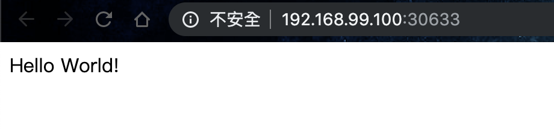

# 第九天：k8s之二：基礎篇之二，Deployment、ReplicaSet、Service、Secrets

Author: Nick Zhuang
Type: kubernetes

# 前言

昨天我們看了一些基礎篇的架構，今天讓我們延續，繼續將基礎篇的部分做個結束，今天的章節內容會用到昨天的部分元件功能，沒印象的務必複習一下，那我們就開始吧！

# Deployment（部署）、ReplicaSet（複製集）

這部分有些入門觀念之前有提過，讓我們再複習下：

### Deployment：

部署，Deployment Controller提供Pods和ReplicaSets可定義的更新，k8s下的Deployment有許多feature可以使用，如：create、update、roll back、pause、resume等，針對Deployment的替代方案可以使用kubectl rolling update這個指令。

### ReplicaSet：

複製集，是基於Replication Controller的改良版，本質差異是在selector的支援多寡，在現在的使用情境下，我們不會直接操作到ReplicaSet，每個不同的Deployment會有他們自己的ReplicaSet，並會自動調配，除非我們有對於複製集有特殊設定需求，不然一般直接套用Deployment的預設即可，ReplicaSet顧名思義是讓同個Pod有多個分身在同時運行，舉例來說：這樣的好處是在更新的時候不會讓使用者斷線。

我們來看個例子會比較清楚：

    $vim first-deploy.yaml
    apiVersion: extensions/v1beta1
    kind: Deployment
    metadata:
      name: helloworld-deployment
    spec:
      replicas: 3
      template:
        metadata:
          labels:
            app: helloworld
        spec:
          containers:
          - name: k8s-demo
            image: 105552010/k8s-demo:v1
            ports:
            - containerPort: 3000

我們這邊的設定有以下幾個特點：

- 將Horizontal Scaling的設置加進來，在昨天的內容，我們是透過Replication Controller做介紹，Deployment所用的是Replica Set，它是Replication Controller的改良版。
- apiVersion的部分，之前都是設定v1，這邊要另外設定成extensions/v1beta1，這個是為了兼容舊版，說明如下：

完整版本號：

    1.6版本之前 apiVsersion：extensions/v1beta1
    
    1.6版本到1.9版本之间：apps/v1beta1
    
    1.9版本之后:apps/v1

後半部細節，如v1、beta那些：

**alpha**

    * 該軟件可能包含錯誤。啓用一個功能可能會導致bug
    * 隨時可能會丟棄對該功能的支持，恕不另行通知

**beta**

    * 軟件經過很好的測試。啓用功能被認為是安全的。
    * 默認情況下功能是開啓的
    * 細節可能會改變，但功能在後續版本不會被刪除

**stable**

    * 該版本名稱命名方式：vX這裡X是一個整數
    * 穩定版本、放心使用
    * 將出現在後續發佈的軟件版本中

**v1**

Kubernetes API的穩定版本，包含很多核心對象：pod、service等

**apps/v1**

    在kubernetes1.9版本中，引入apps/v1，deployment等資源從extensions/v1beta1, apps/v1beta1 和 apps/v1beta2遷入apps/v1，原來的v1beta1等被廢棄。
    apps/v1代表：包含一些通用的應用層的api組合，如：Deployments, RollingUpdates, and ReplicaSets

要查詢現有的集群apiVersion支援狀態，可以輸入指令查詢

    $kubectl api-versions
    admissionregistration.k8s.io/v1beta1
    apiextensions.k8s.io/v1beta1
    apiregistration.k8s.io/v1
    apiregistration.k8s.io/v1beta1
    apps/v1
    apps/v1beta1
    apps/v1beta2
    authentication.k8s.io/v1
    authentication.k8s.io/v1beta1
    authorization.k8s.io/v1
    authorization.k8s.io/v1beta1
    autoscaling/v1
    autoscaling/v2beta1
    autoscaling/v2beta2
    batch/v1
    batch/v1beta1
    certificates.k8s.io/v1beta1
    coordination.k8s.io/v1beta1
    events.k8s.io/v1beta1
    extensions/v1beta1
    networking.k8s.io/v1
    policy/v1beta1
    rbac.authorization.k8s.io/v1
    rbac.authorization.k8s.io/v1beta1
    scheduling.k8s.io/v1beta1
    storage.k8s.io/v1
    storage.k8s.io/v1beta1
    v1

不同k8s版的支援不同，筆者這裡是用1.13

    $kubectl version
    Client Version: version.Info{Major:"1", Minor:"14", GitVersion:"v1.14.0", GitCommit:"641856db18352033a0d96dbc99153fa3b27298e5", GitTreeState:"clean", BuildDate:"2019-03-26T00:04:52Z", GoVersion:"go1.12.1", Compiler:"gc", Platform:"darwin/amd64"}
    Server Version: version.Info{Major:"1", Minor:"13", GitVersion:"v1.13.4", GitCommit:"c27b913fddd1a6c480c229191a087698aa92f0b1", GitTreeState:"clean", BuildDate:"2019-02-28T13:30:26Z", GoVersion:"go1.11.5", Compiler:"gc", Platform:"linux/amd64"}

因為在first-deploy.yaml中的replicas是3，所以Deployment會開啟3個pod一起跑

我們來套用並驗證一下

    $kubectl apply -f pod-deploy.yaml
    deployment.extensions/helloworld-deployment created
    $kubectl get po
    NAME                                     READY   STATUS    RESTARTS   AGE
    helloworld-deployment-58d84cbf69-m72kj   1/1     Running   0          50s
    helloworld-deployment-58d84cbf69-z2hnr   1/1     Running   0          50s
    helloworld-deployment-58d84cbf69-z8699   1/1     Running   0          50s
    $kubectl get rs
    NAME                               DESIRED   CURRENT   READY   AGE
    helloworld-deployment-58d84cbf69   3         3         3       50s

OK，看起來沒啥問題，接著我們來操作下Deployment的功能：

## Update（更新，升版）

在更新前，可以先將deployment設成Pause狀態

    $kubectl rollout pause deployment/helloworld-deployment
    deployment.extensions/helloworld-deployment paused

修改Deployment可使用的資源，若是更新後需要更多資源可以在這邊調整

    $kubectl set resources deployment helloworld-deployment --limits=cpu=200m,memory=512Mi
    deployment.extensions/helloworld-deployment resource requirements updated

更新pod所用的image版本（將v1更新至v2

    $kubectl set image deployment/helloworld-deployment k8s-demo=105552010/k8s-demo:v2
    deployment.extensions/helloworld-deployment image updated

回復正常狀態，解除Pause

    $kubectl rollout resume deploy/helloworld-deployment
    deployment.extensions/helloworld-deployment resumed

這時候可以發現Deployment會自動幫忙替換pod

    $kubectl get po
    NAME                                    READY   STATUS              RESTARTS   AGE
    helloworld-deployment-9bdc75675-978vf   0/1     ContainerCreating   0          3s
    helloworld-deployment-9bdc75675-p7w9p   0/1     ContainerCreating   0          3s
    helloworld-deployment-c4f9f68b4-fm62z   1/1     Running             0          14m
    helloworld-deployment-c4f9f68b4-q5rzq   1/1     Running             0          14m

更新成功後，會變成這樣

    $kubectl get po
    NAME                                    READY   STATUS    RESTARTS   AGE
    helloworld-deployment-9bdc75675-978vf   1/1     Running   0          82s
    helloworld-deployment-9bdc75675-p7w9p   1/1     Running   0          82s
    helloworld-deployment-9bdc75675-rgq7j   1/1     Running   0          74s

我們也可以藉由檢查rollout的狀態去觀察

    $kubectl rollout status deployment/helloworld-deployment
    deployment "helloworld-deployment" successfully rolled out

## Rollback（倒回，降版）

將現有版本回朔到上一個版本。~~使用倒回，返回瑪莎多拉~~

    $kubectl rollout undo deployment/helloworld-deployment
    deployment.extensions/helloworld-deployment rolled back

檢查pod的狀態

    $kubectl get po
    NAME                                    READY   STATUS        RESTARTS   AGE
    helloworld-deployment-9bdc75675-972tr   1/1     Terminating   0          3m51s
    helloworld-deployment-9bdc75675-9ffdx   1/1     Terminating   0          3m50s
    helloworld-deployment-9bdc75675-g8vbl   1/1     Terminating   0          3m51s
    helloworld-deployment-c4f9f68b4-2jr5l   1/1     Running       0          6s
    helloworld-deployment-c4f9f68b4-64pbw   1/1     Running       0          6s
    helloworld-deployment-c4f9f68b4-kkxbf   1/1     Running       0          4s$

等跑好了應該要顯示這樣

    $kubectl get po
    NAME                                    READY   STATUS    RESTARTS   AGE
    helloworld-deployment-c4f9f68b4-2jr5l   1/1     Running   0          48s
    helloworld-deployment-c4f9f68b4-64pbw   1/1     Running   0          48s
    helloworld-deployment-c4f9f68b4-kkxbf   1/1     Running   0          46s

接著我們檢查rolling狀態

    $kubectl rollout status deployment/helloworld-deployment
    deployment "helloworld-deployment" successfully rolled out

檢查rolling的紀錄

    $kubectl rollout history deployment/helloworld-deployment
    deployment.extensions/helloworld-deployment
    REVISION  CHANGE-CAUSE
    2         <none>
    3         <none>

當用不到Deployment的時候，下指令刪除就可以，它會依照YAML中把有定義過的所有相關元件都刪除

    $kubectl delete -f pod-deploy.yaml
    deployment.extensions "helloworld-deployment" deleted

以上為Deployment更新的流程，我們會在管理篇有更細緻的操作。

# Service（服務）

這部分的觀念之前有提過，我們複習下：

k8s服務是一個abstraction，它定義了一組邏輯Pod和一個訪問它們的策略 - 有時稱為micro-service。負責不同Pod之間的溝通，舉例來說，像是前後端的服務需要互相溝通的時候，可以做同步異步的處理。

還記得我們之前提過的helloworld應用嗎？這是[第三天](https://github.com/x1y2z3456/ironman/blob/master/day3/README.md)minikube的內容，那個時候我們需要去做port forwarding才能驗證我們pod裡面的網頁helloworld，那個時候有提到可以不用這麼麻煩，今天我們就來解開這個神秘的面紗。

這是我們之前用的pod設定檔：

    $vim pod-demo.yaml
    apiVersion: v1
    kind: Pod
    metadata:
      name: my-helloworld
      labels:
        app: helloworld
    spec:
      containers:
      - name: k8s-demo
        image: 105552010/k8s-demo
        ports:
        - name: nodejs-port
          containerPort: 3000

接著啟動它

    $kubectl apply -f pod-demo.yaml
    pod/my-helloworld created
    $kubectl get po
    NAME            READY   STATUS    RESTARTS   AGE
    my-helloworld   1/1     Running   0          12s

啟動一個Service，藉此將這個pod的port分享出去

    $kubectl expose pod my-helloworld --type=NodePort --name=my-helloworld-service
    service/my-helloworld-service exposed

查看Service狀態

    $kubectl get svc
    NAME                    TYPE        CLUSTER-IP       EXTERNAL-IP   PORT(S)          AGE
    kubernetes              ClusterIP   10.96.0.1        <none>        443/TCP          161d
    my-helloworld-service   NodePort    10.104.201.107   <none>        3000:30633/TCP   4m4s

取得Service的URL

    $minikube service my-helloworld-service --url
    http://192.168.99.100:30633

接著打開瀏覽器輸入http://192.168.99.100:30633

OK，大功告成！

# Secret（秘密）

Secret對象類型用來保存敏感信息，例如密碼、OAuth令牌和ssh key。將這些信息放在secret中比放在pod的定義或者docker鏡像中來說更加安全和靈活。

### 帳密的字串轉換：

我們來看個簡單的範例

    $echo -n "root"|base64
    cm9vdA==
    $echo -n "password"|base64
    cGFzc3dvcmQ=

編輯一個Secret文件

    $vim my-secret.yaml
    apiVersion: v1
    kind: Secret
    metadata:
      name: mysecret
    type: Opaque
    data:
      username: cm9vdA==
      password: cGFzc3dvcmQ=

新增一個Secret物件

    $kubectl create -f my-secret.yaml
    secret/mysecret created

檢查Secret物件狀態

    $kubectl get secret mysecret -o yaml
    apiVersion: v1
    data:
      password: cGFzc3dvcmQ=
      username: cm9vdA==
    kind: Secret
    metadata:
      creationTimestamp: "2019-09-15T14:24:58Z"
      name: mysecret
      namespace: default
      resourceVersion: "715414"
      selfLink: /api/v1/namespaces/default/secrets/mysecret
      uid: 9866f680-d7c4-11e9-bc55-080027150ab9
    type: Opaque

這時候我們可以看到username和password，我們可以透過一樣的反函數的方式將字串轉換回來

    $echo "cm9vdA==" | base64 --decode
    root
    $echo "cGFzc3dvcmQ=" | base64 --decode
    password

使用完重置

    $kubectl delete secret mysecret
    secret "mysecret" deleted

所以我們可以透過這樣的方式，將已知的Secret物件解碼。

### 實例：建立一個SSH的Secret和Pod

這邊我們實作一個範例，ssh這個功能一般是很常用的，debug有時也會用到，可以參考下：

注意到這邊的設定會用到後續章節：Volume的內容，後續會詳細介紹，先套用既有設定測試就好

我們先建立一個帶有ssh key的Secret

    $kubectl create secret generic ssh-key-secret --from-file=.ssh/id_rsa.pub
    secret/ssh-key-secret created

上面用到的id_rsa.pub（公鑰）下這個指令生成，並指定位置

    $ssh-keygen

接著我們定義一個使用Secret的Pod

    $vim pod-ssh.yaml
    kind: Pod
    apiVersion: v1
    metadata:
      name: secret-ssh-pod
      labels:
        name: secret-ssh
    spec:
      volumes:
      - name: secret-volume
        secret:
          secretName: ssh-key-secret
          defaultMode: 256
      containers:
      - name: ssh-container
        image: rastasheep/ubuntu-sshd:16.04
        command: ["/bin/sh", "-c", "cat /etc/ssh-key/id_rsa.pub >> /root/.ssh/authorized_keys && /usr/sbin/sshd -D"]
        volumeMounts:
        - name: secret-volume
          mountPath: /etc/ssh-key

創建一個使用ssh key並引用Secret的Pod，並在Volume中使用它

    $kubectl create -f pod-ssh.yaml
    pod/secret-ssh-pod created

接著設定port forwarding，測試方便用，當然，我們已經知道這可以用Service代替

    $kubectl port-forward secret-ssh-pod 6666:22
    Forwarding from 127.0.0.1:6666 -> 22
    Forwarding from [::1]:6666 -> 22

再開另一個命令視窗測試連線

    $ssh -p 6666 root@localhost
    root@secret-ssh-pod:~#

因為在pod啟動的時候已經把Secret中的公鑰寫到認證的檔案了，所以可以不用輸入密碼直接進入container操作。

測試成功！

# 小結

今天的部分，我們已經把基礎篇做了一個結束，我們已經知道Deployment對於Pod能有更細緻的操作，像是ReplicaSet的設定（Vertical Scaling）等等，我們也知道，各種不同的物件需要使用正確的apiVersion設置，另外，我們也可以透過Deployment無痛部署，甚至是透過修改它的狀態來實現無痛更新（或倒回），接著，我們更進一步認識了Service，它重新定義了與Pod連線的方式，最後我們看到了Secret，這是存放機敏資料的物件，我們可以透過它來達成測試ssh連線Pod的需求。

# 參考資料

- [Deployment概述](https://kubernetes.io/docs/concepts/workloads/controllers/deployment/)
- [ReplicaSet概述](https://kubernetes.io/docs/concepts/workloads/controllers/replicaset/)
- [k8s的apiVersion](https://segmentfault.com/a/1190000017134399)
- [簡易版pod驗證](https://medium.com/@wrre/kubernetes%E5%AD%B8%E7%BF%92%E7%AD%86%E8%A8%982-%E5%BB%BA%E7%AB%8B%E8%87%AA%E5%B7%B1%E7%9A%84pod-a240f8a00a40)
- [Service概觀](https://kubernetes.io/docs/concepts/services-networking/service/)
- [Secret概述](https://kubernetes.io/zh/docs/concepts/configuration/secret/)
